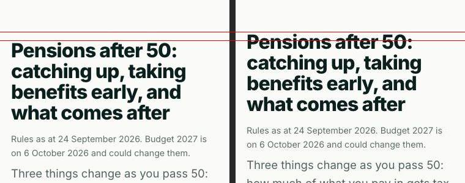
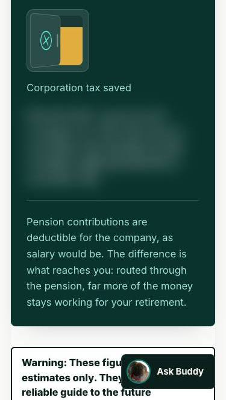
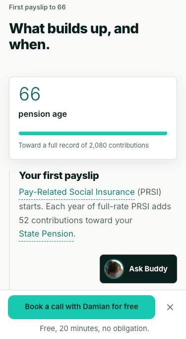
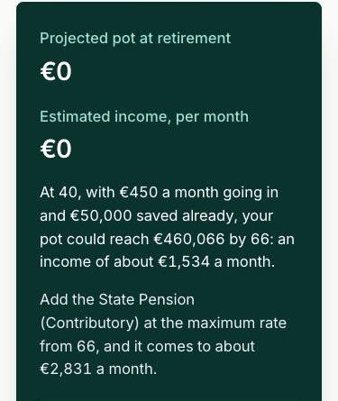
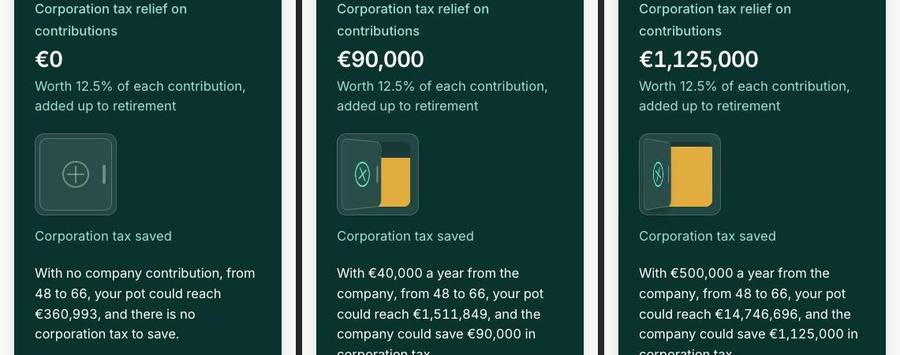
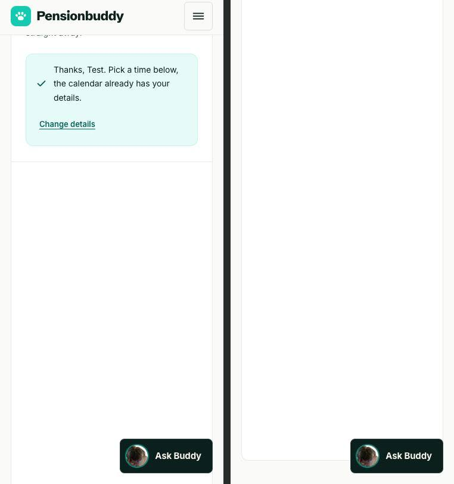
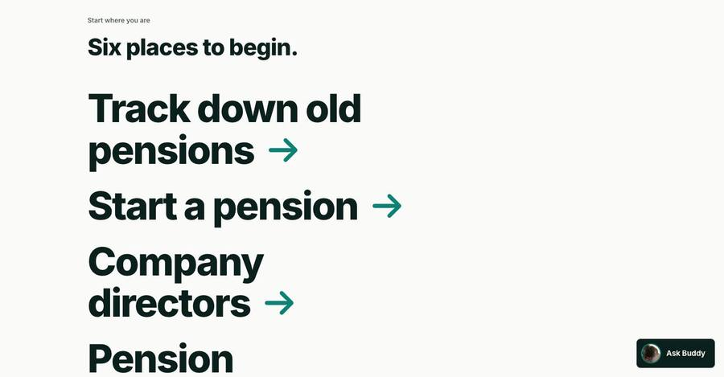

# UX motion audit

- **Date:** 27 September 2026
- **Branch:** `claude/ux-motion`, off `main` at `91c09a1`
- **Status:** Step 2, for approval. Nothing has been built and no page has changed.
- **How to reply:** pick parts by number, for example "build 1a, 1c, 2a, 3a". Each part is one commit and can be picked on its own. Answer decisions by number, or say "defaults" to accept every recommended default. The full reply format is at the end of the document, under [How to reply](#how-to-reply).

Evidence is cited as `file:line` in the repo at `91c09a1`. The measurements come from headless Chrome captures that stay outside the repo, because the repo is the deployed site. They are kept, git-ignored, in `verify-out/ux-motion-evidence/` in the `ux-motion` worktree on your Mac (see N4). The images in this document are crops of those captures of PensionBuddy's own pages, kept in `docs/ux-motion/`. [Appendix D](#appendix-d-evidence-key) maps each finding to its capture or probe file.

## In short

1. **The site already moves more than it shows.** Every page fades up from blank over 0.4s, even with JavaScript off, and a broken reveal jumps text 14px a second after load. Both also apply to the regulator line and the warnings. Upgrades 1 and 2 fix this by removing motion.
2. **Caveats arrive after the claims, and smaller.** On starter, tracker and director, the Central Bank and Qualified Financial Adviser (QFA) lockup is at 0 opacity at 300ms while the button beside it is at 0.85 to 0.91. The home page has the same delay.
3. **Floating chrome gets in the way.** On a phone, Ask Buddy and the book bar cover 170px of an 812px screen for most of the home page. Across the site they sit over warnings, form fields, and the QFA line on director, starter and tracker (upgrade 3).
4. **Figures are shown at values they do not have:** the gap chart's count-up, the starter story card, and €0 headlines with JavaScript off (upgrades 6, 10 and 13).
5. **The gap chart is the one moment worth a scene.** It builds once, in the order that makes the argument, holds briefly on phones while its labels pass, then becomes your own slider (upgrade 8).

**Build first:** 1a, 1c, 2a, 2b, 3a and 3b. They are low risk, and upgrade 8 needs them. Then 4a (the booking step), 5a and 6a.

**The 15 upgrades, in ranked order.** Each splits into parts you can pick one at a time; the full table is under [The ranked upgrades](#the-ranked-upgrades).

1. Caveats and the regulator line: solid from the first frame, at full size
2. One reveal system and the motion tokens: nothing jumps after it appears
3. Floating chrome gives way
4. The booking step, and other waits and confirmations
5. No motion that rewards, pressures or flashes; one colour, one meaning
6. Figures and bars on one clock, on transform
7. The calculator reveal keeps your place, and the growth line draws once
8. Hero moment: the gap, built once, held briefly, then handed to you
9. Sliders you can feel, that only show true values
10. "First payslip to 66" tells the record in order
11. The State Pension pair: the jar, the bars and the glide
12. Comparisons you can see
13. Honest with JavaScript off
14. Home: every door readable, the calculator in real states, depth only on links
15. Scroll rhythm: each band's picture arrives when you reach it, and the seams are calm

**Needs fixing before Thursday 1 October 2026, separate from motion.** `director.html:2016` hard-codes "4.2% PRSI" and "€478" in the markup. From 1 October the page's script writes 4.35% and €477 (`director.html:2478`: the kept amount becomes 476.5, which rounds to 477), so readers with JavaScript off will see a stale rate. The director calculator's three-part key (`director-calculator.html:2360-2361`) also carries 4.2% in its markup and is corrected by script on load. See N1 under [Not motion](#not-motion-noticed-on-the-way).

## Terms used here

- **Caveat:** any warning, disclaimer, source line, "as at" date, assumption or regulatory line.
- **Lockup:** the hero block that names the Central Bank of Ireland and Damian Condon, QFA.
- **Floating chrome:** the parts fixed to the screen: Ask Buddy, the book bar, the peek bar and the analytics bar.
- **Pin:** a block that holds still under the nav (CSS `position:sticky`) while text scrolls past it. Scrolling stays native, so the reader sets the speed.
- **Beat:** one step of a pinned scene.
- **Reading line:** the line across the middle of the screen where a caption counts as being read.
- **Arm:** script puts a chart in its start state (empty bars) while it is off screen, in one frame, and only when motion is allowed. It then plays once when it arrives.
- **Roll:** a figure's old value slides out and the new one slides in, over 200ms, between two true values.
- **Render-diff:** the harness in `tests/render-diff/` that proves the five protected calculator pages (pension-calculator, director-calculator, broker-vs-autoenrolment, state-pension-reality-check and state-pension-entitlement) write identical figures before and after a change.

## What I looked at, and how

- **Pages.** All 31 pages (the 29 root pages plus the two games), at 375x812 and 1440x900, in six groups: home; the audience pages with booking and thank-you; the three calculators; the six State Pension and tool pages; the seven guides; and the legal, game and held pages. [Appendix C](#appendix-c-coverage) lists every page, whether it is live or held, the runs made and its top finding at each width.
- **Four runs per page:** a default run, with a frame 120ms after arriving at each stop and a settled frame 900ms after (at 375 this run used 4x CPU throttling and a scripted scroll for frame timings); a reduced-motion run; and a run with JavaScript off.
- **Probes:** the per-frame opacity of the regulator line, the QFA line and the warnings during load; how much of each caveat the floating chrome covers at each stop; where layout shift comes from; on the calculators, where focus goes after Reveal, how many distinct figures appear per drag and which animations run; and whether the gap chart and the starter card agree with their figures and steps, frame by frame.
- **Scrolling** was done in real time, because virtual time stops IntersectionObserver.
- **Lighthouse:** version 13.5, default mobile emulation, simulated throttling, median of 3 runs, served with gzip from a frozen copy of `main` at `91c09a1`.
- **References:** four research agents captured nine sites on 26 September 2026 with the same rig (at 375 and 1440, with reduced motion and with JavaScript off), and read their CSS and JavaScript bundles for timings.

### What could not be verified

- **No refs folder.** There is none in the repo, so every reference was captured fresh.
- **Revolut** served its security-check page to headless Chrome at both widths, and curl got a 403. Its motion tokens come from that page's CSS. None of the brief's three Revolut patterns (scroll-pinned sections, cards that rotate or stack in 3D as you scroll, and bold full-bleed colour per section) was observed. What is said about its bands, hero morph and cards is second-hand (a design breakdown by Fudge, and two GSAP forum threads) and is marked as such.
- **Klarna** returned "Access Denied" at /ie and /uk. Its patterns were read from its code bundles and its public motion guidelines, and none was seen running.
- **Web-archive copies** were used for Ramp (a Wayback Machine copy dated 24 September 2026) but not tried for Revolut or Klarna. If you want those two seen running before you approve, the rig can be run on archived copies.
- **Ramp** served a machine-readable markdown page to curl and to headless Chrome, so it was studied from the archived copy plus its assets.
- **Robinhood** redirected to its EU page, including from /us/en/, so its US page was not studied.
- **Wise's** article on its motion code returned a 403.
- **Patterns not captured.** Patterns attributed to Material's extended button, the Intercom and Monzo launchers, Apple Reminders, Apple Health, iOS slider detents, the MDN and Stripe Docs anchor highlights, Mercury's inline confirmations, Wise's fee comparisons and side-by-side providers, and Mercury's and Ramp's spend bars come from general knowledge and were not captured. They are marked "general pattern, not captured" wherever they appear.
- **Screen sizes.** Every rig capture is 375x812 or 1440x900. Nothing was measured at 390x844, 360x780 or 375x667, so the pin gate for the scenes is not yet measured (see upgrade 8).
- **Devices and browsers.** Nothing was tested on a real phone, in Firefox or in Safari. Frame timings are indicative only, because headless Chrome has no GPU. Decision D35 asks which phone you will test on.
- **Screen readers.** No screen reader was run. This machine is a Mac, so NVDA (Windows) is not available here; whether a Windows machine is available for Step 3 is unverified.
- **Calendly without JavaScript.** Whether Calendly's own booking page works for a reader with JavaScript switched off is unverified (see D13).
- **Browser support** comes from MDN browser-compat-data 8.1.3 (dated 24 September 2026) and caniuse.
- **Layout shift during scroll** comes from the rig, because Lighthouse lab runs do not scroll.
- **Thank-you's layout shift** varied between Lighthouse runs (0, 0.05 and 0.169, all from the `.lead` timeline). The cause is unverified.

## Step 1: what the references do

Each reference below lists the specific patterns captured, what it does well, what PensionBuddy can use, and what it must not copy. Every rejection is gathered in one place, under [Not recommended](#not-recommended).

### Stripe

**Patterns**

- The hero is a WebGL2 ribbon drawn over a still image. The still is in the markup and fades out over .25s once the canvas has drawn, so it is what shows with JavaScript off.
- "Global GDP running on Stripe" is recomputed every 1250ms. Only the characters that change roll, in the direction of the change: 325ms each, 50ms apart, on the curve (0.33,1,0.68,1). The digits are tabular at a fixed width, so nothing shifts, and the figure pauses off screen.
- A checkout demo cycles through real states. Each field flips over 1420ms after a 4000ms hold, and every loop pauses when scrolled away.
- No heading or paragraph faded in at any stop, at either width. Only illustrations move.
- Card hover works only at 940px and up, with a fine pointer, when motion is allowed.
- One dominant curve, (.25,1,.5,1), is used 41 times. There are 79 reduced-motion rules, plus a listener for changes mid-visit. Under reduced motion, running animations drop from 58-112 to 1.

**Does well.** Text never waits. Numbers roll only between real values. Reduced motion is honoured completely.

**We can use.** Text that never waits (upgrades 1 and 2). A digit roll between two true values (10 and 12). Fills that grow on transform (6). Hover limited to a fine pointer (14). Loops that pause off screen (5).

**Must not copy.** The WebGL hero (1.25MB of JavaScript over 84 requests, a 33ms p95 frame on a phone, and it explains nothing). A ticking vanity number. Cards that are blank with JavaScript off. Endless loops with no pause control. A chat reply built word by word: on a phone, words were still at 0 opacity at 900ms.

### Wise

**Patterns**

- The live calculator is the hero, complete at first paint: server-rendered values, no entrance animation, and its own small print (fees, arrival time) inside the card at label size.
- Typing a new amount: the input resizes, which is a layout animation. At about 500ms, only the rows truly waiting on the server shimmer. For about 800ms the old figure stays at full strength beside the new amount. The new figure then lands with a settle bounce: scale to 1.03 over .3s, on (.34,1.56,.64,1).
- A rate pill cycles by itself every 2600ms. Its figure tweens over 650ms, time-based, and it has a pause button.
- The phone hero deals its cards in over 1.2s, unstacks them over 1.6s on a clock, and fades in its disclaimers last (.8s).
- A pure-CSS sticky card stack: each pin lasts as long as the card is tall, and the stack is static under reduced motion.
- A flag marquee grows min-width on every scroll event, which caused 0.0285 layout shift at 1440.
- One curve dominates, (.6,.2,.1,1), used 63 times. Hidden start states exist only under no-preference.

**Does well.** The product is the headline. Skeletons appear only where something really waits. Tweens are time-based.

**We can use.** The product as the explanation (upgrades 8 and 12). Transform-only bars (6). A sticky pin as long as its element, for the director inputs panel (3d).

**Must not copy.** All-caps headlines. Fees hidden until script runs. A disclaimer revealed last, after 1.6s, with the 2.20% on screen while its warning slot is blank. The settle bounce. Self-cycling figures. A stale figure beside a skeleton. Scroll listeners that animate layout. Loops that keep running under reduced motion.

### Revolut (blocked; none of the brief's three patterns observed)

**Patterns**

- **One named scale** (observed as code in the security-check page's CSS): durations of 100, 200, 300, 450 and 900ms, plus a 1500ms skeleton. A default curve of (0.15,0.5,0.5,1), and a toast curve of (0.175,0.885,0.21,1.65) that overshoots. Timing tokens pair a duration with a curve, so components cannot drift. No reduced-motion rule.
- **Bands (second-hand, Fudge design breakdown, not observed):** hard full-bleed switches between dark and light.
- **Hero morph (second-hand, GSAP forum threads of August 2025, not observed):** the hero photo shrinks into a box on any scroll gesture. The moderator suggested a plugin that listens for wheel and touch intent.
- **3D cards (second-hand, not observed):** they swipe and flip in the apps. The website uses photographic renders (Fudge).

**Does well.** One vocabulary, with paired tokens.

**We can use.** Paired timing tokens (the motion system). Bands with meaning: light for reading, dark only for the tool band.

**Must not copy.** The gesture-driven morph, which is scroll-jacking. 3D flips, which hide the back. The overshooting toast. The 1500ms skeleton. Fine print as the dimmest text (second-hand, Fudge). A decorative colour per section.

### Mercury

**Patterns**

- **A tone line.** The page's tone changes at one line across the middle of the screen: an IntersectionObserver with rootMargin '-50% 0px -50% 0px'. Colours, text included, change over .5s, even under reduced motion. The headline measured 1.24:1 contrast mid-change.
- **A pinned hero.** It is 250vh and plays video with scroll through a spring. It weighs 2.3MB on mobile, and collapsing the pin caused about 1.0 layout shift.
- **Sticky features beside real app demos.** The demos have pause buttons and are paused under reduced motion.
- **Reveals.** Sections rise 50px over .67s on a slight overshoot. 120ms after arriving, they sit at 0.03 to 0.1 opacity.
- **The "not a bank" line.** It is there at first paint, lifted clear of the consent banner, then moved away by a scroll animation.
- **Price digits** roll between states. Film grain changes five times a second.

**Does well.** Restraint. One decision line. Pause controls. The regulatory line at first paint. Footnote numbers that tie claims to their disclosures.

**We can use.** The middle-of-screen line, for scene beats (upgrades 8, 10 and 11). Keeping chrome clear of the consent banner, turned round so the chrome gives way to the caveat (3b).

**Must not copy.** The video pin. Moving the disclaimer away. The page-wide crossfade that includes text colour. Overshoot reveals. Grain at five changes a second. 835KB of JavaScript, and 17.2MB after one scroll on a phone.

### Ramp (studied from the archived copy)

**Patterns**

- The hero is a looping product video: 1.89MB on desktop, 1.30MB on mobile, no poster, and it kept playing under reduced motion.
- Live counters carry role=img and an aria-label holding the final value, so a screen reader hears one number.
- The pinned story, "Systems that never spoke": the pin is capped at min(200vh,1600px) on phones and min(300vh,2800px) on desktop, about 1,900px pinned at 1440. Scroll picks the scene through one opacity threshold (progress .30 to .40), and each scene plays on its own clock. Scene one dramatises chaos, with an email badge that climbs from 3,470 to 7,201.
- Its dominant curve is (.16,1,.3,1), the same as PensionBuddy's.
- A 3400ms border tracer loops around an empty input, and a placeholder types itself.
- An AI disclosure is extra small, labelled "hushed", and sits inside a layer that blurs.
- A newsletter modal covers the phone mid-scroll.

**Does well.** Scroll picks the scene, and the scene keeps its own clock. The pin is capped per breakpoint. Screen readers get the final value. The product is shown in real states.

**We can use.** The scene model and the pin cap (upgrades 8 and 10). Real product states (14b). Final values for screen readers (the motion system).

**Must not copy.** Autoplay video. A 1.81MB Lottie runtime. Stories that manufacture anxiety about money. Mid-scroll modals. Small, faint or animated legal lines. Attention loops near buttons. Blur animations.

### Klarna (blocked; read from its code and public motion guidelines, not observed running)

**Patterns**

- **Push by word.** Each word starts at 0 opacity, 40px down and 13.33px across, then settles over .7s, 0.1s apart per word, on (.22,1,.36,1).
- **Page-wide order.** Blocks rise 20px over .6s. Delays add 0.35s per headline and 0.05s per block, so each hero plays headline, subline, button, then the credit footnote last. 58 blocks are served at opacity 0.
- **"Explore our offering".** Seven words at 100px react to scroll position and focus through a spring. The nearest word opens its description. Under reduced motion it becomes a static list showing every description.
- **Hover.** Transform only, gated on (hover:hover) and (pointer:fine): cards scale to 1.01 over 300ms.
- **Tokens.** A wobbly curve, decelerate (.16,1,.3,1) and accelerate (.4,0,1,1), with durations of 200, 300 and 500ms.
- **Self-running motion.** Count-ups from 0 run over 1800ms, a 5s carousel advances on its own, and headline words rotate every 3s.

**Does well.** The huge type works as a contents list. The fallback shows everything. The token set is small.

**We can use.** The repair of "Six places to begin" (14a). The accelerate curve for anything leaving (the motion system).

**Must not copy.** Content served at 0 opacity. The footnote placed last. Inactive words at .25 opacity, which would be 1.71:1 on PensionBuddy's background. Smooth scrollIntoView on focus. Count-ups. Self-running motion. Hover-only arrows that a keyboard cannot reach.

### Robinhood and Monzo

**Robinhood (EU page)**

- One idea per screen: eyebrow, headline, one sentence, one button, with hard cuts between screens.
- Risk text sits right after the product it qualifies. On a phone it is body size; on desktop it is smaller.
- There is no CSS or scripted animation. Nothing is faint at any stop, the page works with JavaScript off, and layout shift is 0.0004.
- The only motion is looping background video: preloaded, 3.1MB on a phone, with no pause control, and still playing under reduced motion.

**Monzo**

- CSS tokens set durations of 0 to 600ms, easings named by intent, and springs precomputed as linear() curves with a cubic-bezier fallback.
- Every hidden start state sits inside no-preference. Its 1000ms spring reveal leaves blocks at 0.1 to 0.34 opacity 120ms after arriving.
- A carousel scales with its own scroll, through animation-timeline:view(inline).
- A phone mock crossfades between stacked screens on opacity, with the inactive screens aria-hidden.
- Videos play only on screen and only when motion is allowed, and each poster shows the final state.
- Tab swaps run inside document.startViewTransition, with a direct fallback. None of Mercury, Robinhood or Monzo uses cross-document transitions.
- Risk lines sit inside the product card, at body size.

**Does well.** One idea per band. Risk text beside the claim. Opt-in motion. Screens crossfaded, not moved. Browser features detected before use.

**We can use.** Caveats beside the claim, at body size (1d). Hidden states only once script has armed them (the motion system). Same-document startViewTransition with a fallback (4a and 12c). A spotlight crossfade (14b). One idea per band (15).

**Must not copy.** Preloaded video with no pause control. Smaller risk text on desktop. A colour per chapter. The 1000ms spring. Scrubbing anything that shows a value. Stacked sticky bars (about 165px at 375 on Monzo). The same call to action in every chapter.

### Apple product pages

**Patterns**

- **The iPhone 18 Pro camera scene.** A 220vh container pins about 1,080px of scroll. Words rise over a held lens, then the lens zooms out, locked to the scroll.
- **The AirPods Pro 3 scene.** It is 250vh, with about 1,350px pinned: one object, several beats, and callouts on alternating sides that never overlap the object. The pin is released under reduced motion.
- **Reduced motion is a storyboard of finished states.** Text sits at full opacity, videos become end-frame stills, and pins become stacks.
- **Text reveals.** They start at 85% of the viewport, 0.15s apart, with will-change set only while they run. Headlines were at 0.02 opacity 120ms after arriving.
- **The price, the EU energy label and Buy** form one lockup, visible at 120ms. The hero plays once, then rests.
- **"Compare with"** swaps panels that are already in the markup; with JavaScript off every option renders.
- **Footnotes** never animate, but they are small, grey and at the end of the page.
- **The home page, apple.com/ie,** has no scroll reveals at all.

**Does well.** Scroll is the playhead. One idea per beat. A designed reduced-motion storyboard. The legal label shares a lockup with the price. Restraint at the front door.

**We can use.** The sticky stage, cut to half a screen (upgrades 8, 10 and 11). Finished states under reduced motion (the motion system). The caveat in the claim's lockup (1d). Every state in the markup (13).

**Must not copy.** Scrubbed video: 9.18MB in one scroll of the iPhone page at 375. A JavaScript animation engine. Pins of 220 to 250vh. Headlines that are invisible on arrival. Footnotes far from the claim. A late 3D viewer: 0.2459 layout shift at 375. Overshoot curves. Timed carousels.

## Step 2: the audit

### Across the whole site

1. **Every page fades up from blank, regulator line included.** `body{animation:pageIn .4s ease both}` sits at `index.html:292-293`, on the same lines on all 29 root pages. It is CSS, so it runs with JavaScript off. The "Regulated by the Central Bank of Ireland" strip measured 0.07 to 0.41 opacity at 100ms. At the home page's first contentful paint (740ms at 4x CPU), the body was at 0.58, the h1 at 0.32, and the button and regulator line at 0.

2. **The reveal system is broken in three ways.** Four definitions are stacked, and the last one wins (`index.html:87`, `278`, `395`, `605-610`). `.js-reveal .reveal:not(.settled){transform:translateY(14px)}` (`index.html:606`) comes after `.js-reveal .reveal.in{transform:none}` (`index.html:396`), with the same specificity. So revealed text fades in 14px low, then jumps: at 1.6 to 1.8s in the home hero, and at about 1.1 to 1.4s on the guides and legal pages (the privacy h1 moves from 186.1 to 172.1px at 1,186ms). This happens on all 29 pages. A 900ms timer (`index.html:2590`, and on 18 other pages) reveals every section while it is still off screen, so nothing ever enters as you scroll. On starter, all 29 reveals have fired by 1.9s without any scrolling, 25 of them more than 1.4 screens down. On the other ten root pages nothing adds `js-reveal`. Their reveal classes and inline delays are dead code, but they would delay the QFA line if anyone switched them on.

   

3. **Caveats arrive after the claims, and smaller.** On index (`index.html:2077`), starter, tracker and director, the lockup waits .24 to .28s after the button's .18s, and reaches full opacity about 270ms after the button. The calculators put the QFA line last in the hero stagger. The legal pages wrap the whole notice, the Ombudsman route and the QFA line in one reveal. Sizes: "information, not advice" is 13.5px on the nine pages without the 16px floor (`index.html:1299`); "Rules as at" is 14.3px grey under an 18.6px intro; the guides' not-advice note is 15px under a 16px line; the booking note is 12.5px under a 15px button; at 1440 the announce strip is 13px at weight 400 beside a bold "Free". The full list is the [caveat inventory](#caveat-inventory) below.

4. **Floating chrome covers what the reader needs.** At 375, Ask Buddy covers text at nearly every stop on every page. That includes the QFA line on director (even after "No thanks"), starter and tracker (with the analytics bar open); the first lines of the warnings on the director calculator, the fees calculator and the Personal Investment Account (PIA) page; the Ombudsman box; 91 to 100% of the "Not sure" radios on director rules; the booking form's heading; and the footer disclosure. On the home page, with the analytics bar open, the bar's top edge cuts the regulator line (text at 652 to 677px, bar from 658px). Together with the book bar, Ask Buddy covers 170px of an 812px screen from 1,360px to 12,440px down the home page, and the book bar alone covers up to 98% of the survey-averages note as it passes. Ask Buddy moves by animating `bottom` on 17 pages (`index.html:1782-1784`). That is the largest layout-shift source: 0.0168 of the home page's 0.0533 at 375, and every Lighthouse layout-shift entry on index, tracker and director.

   

   

5. **Figures are shown at values they do not have.** The home gap chart grows its bars by height over 1.15s while its figures count up on a separate clock. At 248ms the dark bar reads €36,624 (90% of its value) at 61% of its height, and for about 100ms the amber "a year short" block floats above a teal bar that has not reached it. The height animation also adds 0.0365 layout shift (`index.html:1496-1504`). The starter story card shows "66" and a full bar while the reader is on "Your first payslip". It disagrees with the step being read at 33 of 107 positions at 375, and 48 of 116 at 1440. Its tax-relief step drives the bar to 50% (`starter.html:2246`), which implies 1,040 contributions. The calculators' tween, `const f=REDUCE?1:0.16` (`pension-calculator.html:2309`, `director-calculator.html:2500`), writes 54 to 85 in-between figures per drag and takes about 1.07s to settle at 4x CPU; the same loop redraws the chart's top axis label through in-between euro values (`pension-calculator.html:2367`). With JavaScript off, the headlines read €0 (`pension-calculator.html:2160-2161`, `director-calculator.html:2334-2335`, `broker-vs-autoenrolment.html:2378-2379`), under sentences that state €460,066 and €1,511,849.

   

   

   

6. **Cause and effect happen off screen.** At 375, every calculator's headline sits 1,000 to 1,600px below its first slider (`assets/js/pb-peek.js:4-8`). The home way-of-life cards rewrite a chart 450px above the screen. At 1440, the director inputs panel is 1,111px tall in a 900px window. Reveal drops keyboard focus to the page body on all three calculators.

7. **Motion rewards, pressures or flashes.** Jar dots leap over the rim at 2,080 (`state-pension-reality-check.html:2106-2115`). The director safe unlocks as the relief rises, on a log scale (`director-calculator.html:2852-2856`): €90,000 fills it to 76% and €1,125,000, 12.5 times as much, only to 93%. Seconds tick under "Miss it and that year is gone for good" (`assets/js/pb-deadline.js:117`), and the nav chip changes every minute. The nav dot pulses forever, on 29 pages including booking and thank-you (`index.html:880-883`). The booking button rises 4px, grows 1.5% and throws a 40px shadow, all with !important (`index.html:400`); the button beside it lifts only 2px (`index.html:80`). Buddy blinks about six times a second after a hit (`games/buddys-run.html:985-988`), twice the three-a-second limit. The games' idle and game-over loops keep running under reduced motion (`games/buddys-run.html:545-548`, `962-965`), and Buddy's Run announces the score every 50 points (`games/buddys-run.html:1120`).

   

8. **Colour meaning drifts.** Teal, the State Pension colour, also fills starter's private pots, the pension calculator's "You really pay" (whose legend dot is amber), the compare page's personal pension, the fees "other plan" line (`pension-fees-calculator.html:2059`) and the my-pensions share bars (`my-pensions.html:1896`). Dark, the need colour, draws income tax in the director calculator's three-part bar (`director-calculator.html:2016-2018`, `.pb-cut`). Amber, the gap colour, marks the jar's first row (`state-pension-reality-check.html:2084`, a deliberate earlier choice; see D15) and fills the director's safe, and a dark amber ink colours the director calculator's funding note (`.max-card .mnote`). (historic: Run 42 moved the gap to red; see docs/DESIGN-RUBRIC.md section 3)

9. **Layout properties animate during scroll and input.** Gap bar and living-standards heights, and bar widths. The slider bubble's `left`, set after an offsetWidth read. A forced reflow on every tween frame (142 to 170 per drag). The glossary index's `top`. The nav, which drops from 72px to 62px on the first scroll on all 29 pages (`index.html:269-270`), so the page hops 10px.

10. **There is no motion vocabulary.** There are 8 curves across 870 uses, including an overshoot (.34,1.56,.64,1) used 24 times. There are 31 distinct time values, and 18 inline delay values across 133 uses. Dead motion CSS sits on every page. No page uses @view-transition, startViewTransition or animation-timeline.

### Where it feels flat, static or confusing

| Page | At 375 | At 1440 |
|---|---|---|
| index | With the analytics bar up, the bar cuts the regulator line. A way-of-life tap changes a chart 450px above the screen. The product photo is about 340px wide, so its €460,066 can be read but its warning cannot. The gap chart runs on two clocks, and seconds tick under "gone for good". | A centred text column on cream, with the phone chat starting at 834px of 900. "Six places to begin" hides every explanation until you hover, so a touch laptop never shows them, and hovering one dims the others to .38. |
| starter | The story starts at its ending, disagrees with its text at 31% of positions, and its tax step implies 1,040 contributions. "What time does" counts up from €0 while its bars are already full. Private pots are drawn in State Pension teal. | The card disagrees with the step being read at 41% of positions, and the Buddy phone starts at about y 830, below the fold. |
| tracker | "Mess to order" has already played by the time you look. At rest, its labels sit under the summary card, and that pile is all that reduced-motion and JavaScript-off readers see. | The scene is a 720px box with 150px papers; mid-flight the dark card is half-transparent over "Pension booklet". |
| director | "€1,000 of profit, two ways" swaps a sentence with no picture, and the part that goes to tax (€522 to 30 September 2026, €523 from 1 October) is never shown. The rules cards link only from their heading. | The six-line 68px headline pushes the regulatory line to y 925, below the 900px fold, while the button is at y 813. |
| booking | After "Show me the calendar", a 1000px blank box waits up to 8s (`booking.html:1843`). The not-advice and privacy line leaves with the form (`booking.html:1772`, `1968`). The copy says the calendar is "on the right" (`booking.html:1709`). There is no route without JavaScript. | The same, with a 680px blank box, and the nav still offers "Book a call" beside a pulsing dot. |
| thank-you | The three next steps look identical, and Ask Buddy covers the timeline on first paint. | The nav pulses and still offers "Book a call". |
| calculators | 600 to 900px of blur with no control in view, and focus falls to the page body on Reveal. The sliders and the headline are never on screen together. On the compare page, the second mode and #combined remove the only warning (`broker-vs-autoenrolment.html:2404`). | The director panel is taller than the window, so its main slider and the relief figure are never on screen together, and its safe unlocks. |
| State Pension pages | On the reality check, the headline sits about 1,000px below its slider and snaps, with an amber first row and a spill at 2,080. On entitlement, the veil blurs the assumption lines, and the methods are explained a screen away from their glide. | Both read well in two columns. Inserting the guess card shifts the reality check by 0.0307 at load. |
| PIA, Standard Fund Threshold (SFT), fees, my pensions | The PIA calculator starts 12 screens down with no link to it. At 375 the three fee lines converge within 15px. A pension added on My pensions gets no acknowledgement. | The SFT page's "75%" has no picture, and its year highlight snaps from cell to cell. |
| glossary | A deep link smooth-scrolls 7,714px onto a card that is still at opacity 0. The index covers up to 47% of the not-advice note. | 7 of the 22 index terms can be reached; the short Pension card stretches to the height of the Tax relief card. |
| guides and checklists (over 50, self-employed, UK pensions, both checklists) | Each article is one reveal that fades, then jumps 14px (for example `pensions-over-50.html:1738`). On self-employed, "Free, 20 minutes" sits directly on the not-advice sentence, which opens an eight-line sources paragraph. The checklists give no count. | Each article is a left column in an empty frame, with no list of its anchored sections. |
| legal | Terms is 8,815px with no contents list. Ask Buddy covers the last lines of text at every stop, including the consumer-protection clause and the Ombudsman box. | A 70ch column set left, with about 45% of the screen empty. |
| pension readiness check (held) | The 13.5px information-only box sits under a 17.6px promise. Ask Buddy covers the second radio option. The score and marker snap in with no transition. With JavaScript off, its noscript line is honest. | The same; calm and static. |
| find my pension (held) | Ask Buddy covers "Add another employer" and "Calculator results are illustrations". With JavaScript off, Continue does nothing and there is no noscript note. Steps swap instantly. | The sticky "What this is, and what it is not" panel works well. |
| games | Buddy's Run blinks at 6Hz and, with JavaScript off, collapses to nothing. Jargon Battle's intro overflows its frame, and with JavaScript off its Start button does nothing. | Tidy framed cards; the blink is the same. |

The booking row at 375:



The index row at 1440:



### Where scroll feels cheap

| Page | What cheapens it |
|---|---|
| All 29 | The 14px jump after load, the 10px nav hop on the first scroll, and sections that simply sit there: below the hero, the early frame equals the settled frame at every stop. |
| index | 170px of floating chrome. The gap bars shift layout (0.0365). The seams into and out of the dark band pass through grey (`index.html:1964-1974`). The way-of-life breakdown opens 515px in one frame. |
| starter | The pinned story leaves about 459px of 812 to read, and covers up to 137px of step text. The card jumps between 167px and 195px tall. The living-standards bars show in-between euro figures and strike through "€16,831" mid-grow. |
| tracker, director | A hard colour cut about every screen. Ask Buddy is the only layout-shift source. |
| calculators | Bars trail the figures by up to .9s. The pulse plays a second late. |
| glossary | Cards drop 14px while fading in, then rise. The index animates `top`. Under reduced motion the smart nav is switched off rather than made instant, so reading space falls from 81% to 72%. |
| booking | The move from form to calendar is a jump cut: 1,000px of form collapses to 155px, and 1,000px of white appears below it. |

### Caveat inventory

The rule: caveats are never animated away, delayed, faded, veiled or covered, and are never smaller or lighter than the copy they qualify (D2 defines "the copy they qualify").

This is the single list. In Step 3 its selector column becomes one list in `tools/pagebuild.py`, which writes the selector in MOTION rule 2, and which the new `caveat_still` check and the TRUST sizes read, so the three cannot drift apart. Sizes are at 375 unless stated. Contrast is against the element's own background.

| # | Caveat (selector) | Where | Today: size, weight, ink (contrast) | The copy it qualifies | What moves or hides it today | Proposed (D1 unless noted) |
|---|---|---|---|---|---|---|
| C1 | Announce strip, "Regulated by the Central Bank of Ireland" (`.announce`) | All 29, e.g. `index.html:2014` | 13px, 400, ink-2 (5.77) | "Free" at 1440: 13px, 600, ink (15.65) | Page fade: 0.07 to 0.41 at 100ms | 13px, same weight and ink as "Free" (D3) |
| C2 | Hero lockup (`.pb-reg`) | `index.html:2077`, `starter.html:2194`, `tracker.html:1988`, `director.html:1982` | 13.6px; names 600 in ink (16.4), "30 years" 400 in ink-2 (6.0) | Button 15px/600; lede 16.6px | Reveal .24 to .28s after the button, then the 14px snap. Covered by Ask Buddy; cut by the analytics bar on index | The lede's size at each width (16.6px at 375); weights and inks as today |
| C3 | "Reviewed by" line (`.pb-reviewed`, TRUST block) | Ten pages, e.g. `pension-calculator.html:2133` | 16px, 400, ink-2 (6.04) | Lede 17.6px at 375, 20.1px at 1440 | Reveal delay .16s, last in the hero (live on the pension and director calculators, inert elsewhere) | The lede's size at each width, ink-2 |
| C4 | "Illustration only" on the hero phone (`.hc-note`) | `index.html:2097` | 13.6px, 400, ink-3 (5.28) | Chat bubbles 13.5px in ink (15.65) | Fades with the phone (.22s) | 13.6px in ink, out of the phone's reveal |
| C5 | Gap chart sources (`.pb-src`) | `index.html:2129`, `2136` | 14.3px, 400 (5.09) | The chart's labels and the aside's copy | Reveal, fired off screen by the 900ms timer | 16px (1rem), ink-2 |
| C6 | Survey-averages note (`.gap-note`) | `index.html:2161` | 14.3px, 400, ink-3 (5.09) | Slider result 16.3px; the chart | Reveal; sits about 900px below the chart; book bar covers up to 98% | 16.3px, ink-2; moved under the chart (D7) |
| C7 | Way-of-life note and source (`.pb-life-note`, `#pbLife .pb-src`) | `index.html:2157`, `2159` | 14.3px, 400 (5.83, 5.09) | Category rows 14.7px | None; appears with the split | 16px, ink-2 |
| C8 | Product caption (`.pb-product-cap`) | `index.html:2184` | 13.6px, 400, white at .62 (7.14) | Description 17.6px (11.0) | Reveal .12s | The description's size and ink |
| C9 | The warning inside each product photo | index, starter, director | Unreadable at 375 | Its €460,066 or €1,511,849, which can be read | None | 14b: crop so it reads at its figure's size, or set the calculator's warning as a real-text caption |
| C10 | Deadline scope line (`.tk-who`) | `index.html:2213` | 13.3px, white at .55 (5.21) | The band's body copy, 14.3px (about 8:1) | Fades with the band | The band's body size and ink |
| C11 | "Information, not advice" (`.infoadvice`) | 17 pages, e.g. `index.html:2326` | 13.5px, 400, ink-2 (5.77) on the nine pages without the 16px floor; 16.6px elsewhere | Body copy 15.3 to 17.6px | Reveal where reveals run | 16px (1rem), ink-2, on all 17 |
| C12 | Warning boxes (`.pb-warn`) | `pension-calculator.html:2168`, `director-calculator.html:2348`, `pension-fees-calculator.html:2202`, `pia.html:2374`, `starter.html:2283`, `2314`, `2346` | 16.6px, 700, ink (17.12) | Stronger than the result copy | Page fade; inside reveal containers on starter; covered by Ask Buddy as they enter | No size change; held still (1a) and never covered (3b) |
| C13 | The compare page's only warning (`.pb-warn`) | `broker-vs-autoenrolment.html:2404` | As C12 | | Hidden in the second mode and on #combined | One copy under the results in both modes (1b, D9) |
| C14 | Result caveat line, mint on dark (`.res-hero .foot`) | `pension-calculator.html:2166`, `broker-vs-autoenrolment.html:2381`, `2465`, `pia.html:2372`, `standard-fund-threshold.html:2184`, `pension-fees-calculator.html:2200` | 16.6px, 400, mint #9FDDD2 (9.01) | The result sentence (`.pb-say`), white (13.76) | Inside the results reveal (inert off the two calculators) | The result sentence's white, same size (D4) |
| C15 | PIA notes (`.pia-note`) | `pia.html:2366-2368` | 16.6px, 400, mint (9.01) | The result sentence (13.76) | None | As C14 (D4) |
| C16 | Relief-limit note (the span in `#reliefOut`) | Written by `calc()` at `pension-calculator.html:2456` | Inline 13px, 500 | The 19px/500 sentence it qualifies | None | The sentence's size, by a CSS rule outside the protected script |
| C17 | Email disclaimer (`.ec-note`) | `pension-calculator.html:2222`, `director-calculator.html:2409` | 16.6px, 400, ink-3 (5.52) | The offer line, 16.6px/700 in ink | Inline delay .3s | Ink; weight stays 400 |
| C18 | Funding-maximum note (`.max-card .mnote`) | `director-calculator.html:2392` | 16.6px, 400, dark amber rgb(122,90,18) | The 19px/500 line above it | Inline delay .26s | 19px, ink-2 (the amber also breaks colour meaning). Scoped to `.max-card`, because the entitlement page uses `.mnote` for `#m1Cap` |
| C19 | Compare note (`.pb-my-note`) | `broker-vs-autoenrolment.html:2405` | 16.6px, 400, ink-3 (5.52) | `.pb-my-fig`, 16.6px/600 | Hidden in the second mode | Moves with the warning (1b); ink-2 |
| C20 | Ladder note (`.pb-lad-note`) | `glossary.html:1970`, `pension-calculator.html:2201`, `broker-vs-autoenrolment.html:2454`, `starter.html:2382`, `director.html:2032` | 14.5px, 400 (6.31), equal to the ladder | The ladder | Fades with its card; Ask Buddy covers 45% (glossary) | No size change; held still |
| C21 | Starter notes (`.pb-sa-note`) | `starter.html:2284` and five more | 13.6px, 400, ink-3 (5.28) | Body 16.6px; figures 17.5px/600 | Inside reveal containers | 16.6px, ink-2 |
| C22 | Entitlement assumption lines (`#mScale`, `#m1Cap`, `#mWhy`) | `state-pension-entitlement.html:2348`, `2332`, `2350` | 16.6px, 400 (5.52 for `#mScale`) | `#mClose`, 16.6px (17.12) | Blurred by the guess veil until Reveal | Never veiled (1b, D10) |
| C23 | My pensions note, "Nothing here is a projection" (`.pt-note`) | `my-pensions.html:2043` | 14.3px, 400, ink-2 (6.31) | The links beneath, 15.3px | None | 16px, ink-2 |
| C24 | "Topics to discuss, not advice." (`.dr-src`) | `director-pension-rules.html:2046` | 14.3px, 400, ink-2 (6.04) | List items, about 15.7px in ink | Appears with the list, after it | The list's size and ink, moved above the list (4d) |
| C25 | "Rules as at" and "Last checked" (`.legal .updated`) | The five guides and checklists, e.g. `pensions-over-50.html:1740`, `old-pension-checklist.html:1757` | 14.3px, 400, ink-3 (5.28) | Intro 18.6px; body 16.6px | Fades and jumps 14px with the article | 16.6px (the body's size), ink-2 |
| C26 | Guide not-advice note (`.legal .ck-note`) | `pensions-over-50.html:1767`, `self-employed-pensions.html:1761`, `uk-pensions-in-ireland.html:1759`, `old-pension-checklist.html:1786`, `director-year-end-checklist.html:1785` | 15px, 400 (6.04) | "Free, 20 minutes, no obligation." at 16px, directly above | Fades with the article | 16px; the not-advice sentence in its own paragraph (D8) |
| C27 | Legal notices, whole (`.legal`, `.legal .callbox`) | `privacy.html`, `terms.html`, `complaints.html:1733`; `404.html:1734`; `how-we-work.html:1748` | Body size | | One reveal: fades over .62s, then jumps 14px | Held still (1a); no size change |
| C28 | Booking note (`.qnote`) | `booking.html:1772` | 12.5px, 400 (6.31) | Submit button 15px/600 | Card fade (at 375, 0 until 1,081ms); hidden with the form | 15px, ink-2; kept on screen after submit (1c) |
| C29 | Thank-you tool cards, "Illustration only." (`.assure .ad`) | `thank-you.html:1769`, `1774` | 13px, 400 (5.52) | Card title 13.3px/600 | Card reveal (0 until 1,070ms at 375) | 13.3px, ink-2 |
| C30 | Footer disclosure (`.disclosure p`) | All 29, e.g. `pension-calculator.html:2266` | 14.3px, 400, ink-3 (5.28) | Footer links 14.5px (6.04) | Page fade; Ask Buddy covers it at 375 | 14.5px, ink-2 |
| C31 | Already meets the size rule: `.pia-asat`, `.sft-asat`, `.dr-asat`, `.sft-note`, `.srcnote`, `.assume`, `#spNoneFoot`, `.subnote`, `.sft-small`, `.sft-strip-note` | Tool and calculator pages | 16.6 to 17.6px | | None, or inert delays | No size change; held still, and inert delays deleted (1a) |

### Reduced motion and JavaScript off today

**Reduced motion** is calm, static and complete on every page: no animations run, no text is faint, and the charts and chat show their final state. What remains is Ask Buddy's instant jump (which still counts as layout shift), the smart nav switched off rather than made instant (which costs reading space), and the games' idle sprite loops.

**JavaScript off** hides nothing, but misleads or leaves controls that do nothing. Three calculators show €0 headlines. The jar shows 0 of 40 dots and no caption, with its bars drawn full beside "81% of modest". The fees chart is empty. Booking has no route to a time slot. The checklists' print buttons, the director-rules form and the controls on My pensions and the finder do nothing. Buddy's Run collapses at 375, and Jargon Battle's start button does nothing. Starter's story card stays sticky and covers text. The page fade still runs, because it is CSS.

### Performance baseline

Lighthouse 13.5 mobile (default emulation, simulated throttling), median of 3 runs against the frozen `main` at `91c09a1`, with each run's value in brackets where the runs differ.

On every page, first contentful paint is bounded by the render-blocking Google Fonts stylesheet (about 780ms). The home page's largest contentful paint element is the hero h1, held back by its reveal for 1,266ms of element render delay.

| Page | Performance | Accessibility | Best practices | SEO | First contentful paint (s) | Largest contentful paint (s) | Total blocking time (ms) | Cumulative layout shift |
|---|---|---|---|---|---|---|---|---|
| index | 90 (89, 90, 90) | 97 | 100 | 100 | 2.90 (2.91, 2.76, 2.90) | 2.98 | 0 | 0.0066 |
| starter | 90 | 96 | 100 | 100 | 2.89 | 2.89 | 0 | 0.0066 |
| tracker | 90 | 96 | 100 | 100 | 2.89 | 2.97 | 0 | 0.0066 |
| director | 90 | 96 | 100 | 100 | 2.89 | 2.89 | 0 | 0.0066 |
| booking | 91 (94, 91, 91) | 96 | 100 | 100 | 2.74 (2.45, 2.74, 2.75) | 2.74 | 0 | 0 |
| thank-you (1) | 91 (83, 91, 91) | 96 | 100 | 66 | 2.74 | 2.74 | 0 | 0.0501 |
| pension-calculator | 90 (94, 90, 90) | 97 | 100 | 100 | 2.89 (1.68, 2.90, 2.89) | 2.89 | 0 | 0.0049 |
| director-calculator | 90 (91, 90, 90) | 97 | 100 | 100 | 2.90 (2.74, 2.90, 2.90) | 2.90 | 0 | 0.0033 |
| broker-vs-autoenrolment | 90 | 97 | 100 | 100 | 2.90 | 2.90 | 0 | 0.0049 |
| state-pension-reality-check | 90 | 97 | 100 | 100 | 2.89 | 2.89 | 0 | 0.0152 |
| state-pension-entitlement | 91 (94, 90, 91) | 97 | 100 | 100 | 2.74 (1.68, 2.91, 2.74) | 2.91 | 0 | 0.0249 |
| glossary | 91 (90, 99, 91) | 96 | 100 | 100 | 2.76 (2.89, 1.68, 2.76) | 2.76 | 0 | 0.0184 |
| pensions-over-50 | 91 | 96 | 100 | 100 | 2.75 | 2.75 | 0 | 0 |
| pia | 90 (90, 91, 90) | 97 | 100 | 100 | 2.89 (2.89, 2.75, 2.90) | 2.89 | 0 | 0.0049 |
| standard-fund-threshold (2) | 90 | 97 | 100 | 100 | 2.89 | 2.89 | 0 | 0.0041 |
| pension-fees-calculator | 90 | 97 | 100 | 100 | 2.90 | 2.90 | 0 | 0.0049 |

(1) Measured separately, by the same method. Its runs had layout shift of 0.169, 0 and 0.05, all from the `.lead` timeline; the cause is unverified. SEO 66 is expected on a noindex page.

(2) One run failed with `NO_FCP`, a known headless flake, so this is the median of two.

**The runs are noisy.** First contentful paint is bimodal: some runs paint at 1.68s and most at about 2.9s, and a single fast run moves performance by 3 to 9 points (glossary scored 90, 99 and 91). The external fonts fetch drives the spread. A one-point "drop" in a median of 3 can therefore be noise, which is why Step 3 measures differently (below).

The other 13 root pages and the two games have no baseline yet. Step 3 measures each one before touching it, including find-my-pension, my-pensions, pension-readiness-check and director-pension-rules, which inherit the calculators' slider script (part 9a).

**How Step 3 will measure.** For each page a commit touches, the fonts stylesheet and font files are served from the local server on both sides, so the external fetch drops out of the comparison. Runs alternate on the same machine between the frozen before-copy and the build (before, after, before, after), five of each. "No drop" means no category median goes down, the largest contentful paint median is no more than 50ms slower, and the layout shift median rises by no more than 0.002. Those two tolerances are my proposal, not a standard; change them if you want them tighter. The spread (lowest and highest run) is reported with every median, failed runs are recorded and left out, and three runs of each side against the normal Google-hosted fonts are reported alongside for reference. The home page's largest contentful paint is reported before and after part 1a.

## The ranked upgrades

There are 15 upgrades, ranked by value to the reader (understanding and booking) against risk, with the foundations that later upgrades need first. The brief asks for one item per commit, and several upgrades are too big for one reviewable commit, so each upgrade is split into **parts**. A part is one commit, is gated on its own, and can be picked on its own.

**Effort.** S: one page or one shared file, CSS or a small script, one gate run. M: several pages, or one protected calculator, or a shared script. L: a new scene or a change to shared infrastructure, plus new tests and probes.

**Build notes.** How each part will be built, its guardrails and how it will be proven are in [Appendix A](#appendix-a-build-notes-per-part).

| Part | What you see | Pages | Effort | Needs first | Decisions |
|---|---|---|---|---|---|
| **1** | **Caveats and the regulator line: solid from the first frame, at full size** | | | | |
| 1a | No page fades up from blank; no caveat, or anything holding one, is revealed, delayed or moved | All 29 root pages | M | none | none |
| 1b | The compare warning stays in both modes; the entitlement veil covers figures only | compare, entitlement, `pb-guess.js` | M | 1a | D9, D10 |
| 1c | The booking note stays on screen after "Show me the calendar" | booking | S | 1a | none |
| 1d | Every caveat at the size and ink of the copy it qualifies | Rows C1 to C30 of the caveat inventory | M | 1a | D1 to D6, D8 |
| **2** | **One reveal system and the motion tokens** | | | | |
| 2a | Nothing visible: the MOTION block, the head line and `pb-motion.js` land, with their guards | All 29 | M | none | D27 |
| 2b | No line jumps 14px after load; the nav keeps its height; deep links land at once | All 29 | M | 1a, 2a | D25, D26 |
| **3** | **Floating chrome gives way** | | | | |
| 3a | Nothing visible: Ask Buddy's two script copies become one guarded file | Every page with Ask Buddy | M | none | none |
| 3b | Ask Buddy tucks to its photo and steps aside; the book bar and peek bar step down for caveats; nothing covers a focused control | Every page with floating chrome | L | 2a, 3a | none |
| 3c | The glossary index follows the nav without re-layout, and shows all 22 terms at 1440 | glossary | S | 2a | none |
| 3d | The director inputs panel keeps its slider and figure on screen at 1440 | director-calculator | S | 2a | none |
| **4** | **The booking step, and other waits and confirmations** | | | | |
| 4a | The booking card changes in place, with an outline where the calendar will be, a route after 4 seconds and a route with JavaScript off | booking | M | 1c, 2a | D11, D13, D22, D29 |
| 4b | Thank-you marks "Now", and the nav drops "Book a call" | thank-you | S | 2a | D22, D29 |
| 4c | The checklists show a quiet "3 of 10 ticked" | both checklists | S | 2a | D11, D27 |
| 4d | "Topics to discuss, not advice." sits above the director-rules list | director-pension-rules | S | 1a | none |
| 4e | An added pension arrives with a small rise | my-pensions | S | 2a | none |
| **5** | **No motion that rewards, pressures or flashes; one colour, one meaning** | | | | |
| 5a | The jar spill, the safe, the pulsing dot, the ticking clock, the booking button's jump and the game strobe go; the games rest under reduced motion | reality check, director calculator, index, all 29 (nav and button), games | M | 2a | D11, D15, D19, D21, D29, D30 |
| 5b | Teal only for the State Pension, amber only for a gap, dark only for need; "yours" in one neutral | starter, pension and director calculators, compare, fees, my pensions | M | 2a | D14, D15, D16 (historic: Run 42 moved the gap to red; see docs/DESIGN-RUBRIC.md section 3) |
| **6** | **Figures and bars on one clock, on transform** | | | | |
| 6a | The home gap chart builds once on transform, with its figures final | index | M | 2a | D23 |
| 6b | Starter's living-standards chart and "What time does" do the same | starter | M | 2a | none |
| 6c | Calculator bars move with their figures; the late pulse goes | pension and director calculators, compare | S | 2a | D18 |
| **7** | **The calculator reveal keeps your place, and the growth line draws once** | | | | |
| 7 | A Reveal button beside the blur, focus on the result, one plot draw | Five calculators, `pb-guess.js` | M | 1b, 2a, 3b | none |
| **8** | **Hero moment: the gap, built once, held briefly, then handed to you** | | | | |
| 8 | See [the home-page hero moment](#the-home-page-hero-moment) | index | L | 1a, 2a, 2b, 3b, 6a | D7, D11, D23, D24, D35 (D32 at 1440) |
| **9** | **Sliders you can feel, that only show true values** | | | | |
| 9a | The bubble rides the thumb with no bounce; the home slider gets one; bubbles are hidden from screen readers | Every slider page, including the four that inherit the skeleton's script | M | 2a | none |
| 9b | Quiet notches, with a visible legend, where a rule changes | entitlement, SFT (reality check per D15) | M | 9a | D33 |
| 9c | Optional: the pension and director headlines show only true values during a drag | pension and director calculators | L | 9a | D17 |
| **10** | **"First payslip to 66" tells the record in order** | | | | |
| 10 | The story card starts at the first payslip and agrees with every step | starter | M | 2a, 2b, 3b, 6b | D24, D28, D35 |
| **11** | **The State Pension pair** | | | | |
| 11a | The jar fills only the dots that change; the living-standard bars show the gap | reality check | M | 2a, 5a, 13a | D15 |
| 11b | The entitlement glide stays beside its explanation | entitlement | M | 2a, 3b | D24, D35 |
| 11c | Optional: a span from the first paid year to the year before 66 | entitlement | S | 11b | D11 |
| 11d | Screen readers hear the settled result once per drag | reality check, entitlement | S | none | D20 |
| **12** | **Comparisons you can see** | | | | |
| 12a | "€1,000 of profit, two ways" as a bar that splits | director | S | 5b | D11, D12, D16 |
| 12b | A gap strip stays in view while you choose a way of life | index (375) | M | 2a, 3b, 6a | D24 |
| 12c | The compare modes crossfade only their results | compare | M | 1b, 2a | none |
| 12d | The fees chart shades what charges take | fees | S | 2a | D14, D16 |
| 12e | One limit bar for the threshold share | SFT | S | 2a | D14 |
| 12f | Three outcomes on one scale | PIA | S | 2a | D14, D36 |
| **13** | **Honest with JavaScript off** | | | | |
| 13a | The calculators and the jar show their default figures in the markup | pension, director, compare, reality check | M | 1a | D11 |
| 13b | Other dead controls are hidden or explained; the games and the fees chart say what they need | fees, games, checklists, director rules, my pensions, finder | S | none | D11 |
| **14** | **Home: every door readable, the calculator in real states, depth only on links** | | | | |
| 14a | Every "Six places to begin" explanation is always readable | index (1440) | S | 2a | none |
| 14b | The calculator photo moves through three real states, with a readable warning | index, starter, director | M | 2a | D11 |
| 14c | Whole-card links get a soft shadow on hover or focus | director, thank-you, index | S | 2a | none |
| **15** | **Scroll rhythm: each band's picture arrives when you reach it, and the seams are calm** | | | | |
| 15a | The tracker's paperwork gathers into a readable fan | tracker | M | 2a | none |
| 15b | The glossary's relief ladder fills in age order | glossary | S | 2a | none |
| 15c | Calm seams into and out of the dark bands | index, starter, tracker, director | S | 2a | D34 |

### 1. Caveats and the regulator line: solid from the first frame, at full size

**What you see.** At both widths, the announce strip, the lockup, "Illustration only", the warnings and their sources, "information, not advice" and the "Rules as at" dates are solid in the first painted frame, together with the headline and the button. Nothing fades up from blank, and the legal pages stand still. The compare page's warning sits under the results in both modes. The entitlement page veils only its figures. After "Show me the calendar", the not-advice line stays on screen. Once D1 is answered, every caveat reads at the size and ink of the copy it qualifies, and at 1440 the announce strip matches "Free".

**Borrows from.** Stripe: no heading or paragraph faded in at any stop, at either width (observed). Apple: the price, the energy label and Buy share the first frame, visible at 120ms (observed). Mercury: the regulatory line is on screen at first paint, clear of the consent banner (observed). Monzo and Robinhood: the risk line sits beside the claim, at body size on a phone (observed).

**Why it helps.** A first-time reader who sees €460,066 before "illustration only" reads it as a promise, and the reader should know who regulates the adviser before acting on any figure. It also removes the reveal from the home page's largest-paint element. That should improve largest contentful paint, but it will be measured, not promised.

**Parts.** 1a (M), 1b (M), 1c (S), 1d (M).

### 2. One reveal system and the motion tokens: nothing jumps after it appears

**What you see.** No line slides 14px a second after load, and the hero is simply there on first paint. The nav keeps its 72px height on the first scroll and fades in a hairline, so the page no longer hops 10px. Nothing below the hero pretends to reveal. `glossary.html#standard-fund-threshold` lands instantly on a readable term, with a teal tint fading over 640ms; under reduced motion, today's static tint stays. Links to `index.html#gap` and `#story` also land instantly. A hero chat message, once shown, stays shown when you scroll back up.

**Borrows from.** Apple's home page: no scroll reveals, 0 faint text at every stop (observed). Stripe: text never waits (observed). Monzo: hidden start states exist only under no-preference (observed in its CSS). Revolut: timing tokens that pair a duration with a curve (observed in its security-check page's CSS). A fading anchor highlight: general pattern, not captured.

**Why it helps.** A steady page reads as a trustworthy one. Nothing is lost, because today the reveals fire off screen. It removes script from 19 pages, and it lands the MOTION block that every later part uses.

**Parts.** 2a (M), 2b (M).

### 3. Floating chrome gives way

**What you see (375).** After the first scroll, Ask Buddy shrinks to Buddy's round photo, at least 44 by 44px and wholly inside the screen; screen readers still hear "Ask Buddy". It steps aside while a caveat, a form field, the calendar or the control you are using (by touch or by keyboard) is under it, and comes back once that area has been clear for 600ms. With the book bar up, the photo docks in the bar's row, giving back about 70px of the 170px. The book bar itself steps down while a caveat passes through the bottom 100px of the screen, and comes back when it has passed; it never moves while it has focus. The peek bar steps down while a warning passes behind it. While the analytics choice is open, Ask Buddy waits off screen and out of the tab order. Nothing nudges the page. The glossary index follows the nav without re-laying out.

**At 1440,** the glossary index wraps, so all 22 terms show. The director inputs panel holds by its bottom edge once "Company contribution / year" is in view, so the slider and its tax figure are on screen together, and any control in the panel that takes focus is brought fully into view.

**Borrows from.** Mercury: the "not a bank" pill lifted clear of the consent banner (observed), turned round so the chrome gives way to the caveat. Wise: a sticky pin as long as its element (observed in its CSS), for the director panel. Launchers that collapse to an icon (Material's extended button, the Intercom and Monzo launchers): general pattern, not captured.

**Why it helps.** A reader cannot understand a warning they cannot see, and a keyboard user cannot use a control hidden behind a button. The pill is also the site's largest layout-shift source.

**Parts.** 3a (M), 3b (L), 3c (S), 3d (S).

### 4. The booking step, and other waits and confirmations

**What you see (375).** **Booking (4a):** after "Show me the calendar", the card changes in place. The form gives way to the existing "Thanks, [name]. Pick a time below" in a 200ms crossfade of that region only, where the browser supports it, and at once elsewhere. The not-advice and privacy line stays under it, still. A still outline of a month and its time slots, at the calendar's own height, reads "Loading Damian's calendar", and the live calendar paints over it with no shimmer. If the calendar has not loaded after 4 seconds, one line offers the existing "Open the booking calendar" link, and the 8-second fallback reuses that line. On a phone the copy no longer says "on the right". With JavaScript off, a sentence leads to a slot (D13). **Thank-you (4b):** "Now: check your inbox" gets a filled marker, and the nav drops "Book a call" on booking and thank-you (D22). **Checklists (4c):** a tick greys the item and a line reads "3 of 10 ticked"; nothing is stored. **Director rules (4d):** "Topics to discuss, not advice." moves above the list. **My pensions (4e):** an added row arrives with a 6px rise over 200ms. The ticks on booking and thank-you are drawn or shown already drawn, per D29.

**At 1440,** the same, with the outline at 680px.

**Borrows from.** Stripe: a still is painted first, and the live canvas takes over (observed). Wise: placeholders only for a real wait (observed). Monzo: startViewTransition, with a direct fallback (observed in its code). A quiet count, and confirmations that simply appear (Apple Reminders, Mercury): general pattern, not captured.

**Why it helps.** This is the moment of commitment, and today it is a white void for up to 8 seconds. The not-advice line disappears just as the name and email go to Calendly, and without JavaScript there is no way through.

**Parts.** 4a (M), 4b (S), 4c (S), 4d (S), 4e (S). The two held pages, the readiness check and the finder, are left out (D37).

### 5. No motion that rewards, pressures or flashes; one colour, one meaning

**What you see (both widths).** **Removals (5a):** at 2,080 the jar is simply full. The director safe is removed (recommended, D19). The deadline band and the nav chip show "About N days left", recomputed when the page loads and when you come back to the tab, never on a timer (D21); with JavaScript off the band shows the date sentence, not "--" boxes. Nothing pulses in the nav. The booking button lifts 2px, like its neighbour, and presses to 98% in 120ms. In Buddy's Run, a hit leaves Buddy steadily half-transparent, as reduced-motion players already see, and a new best shows a still happy Buddy (D30). Under reduced motion the games' idle scenes rest on one frame; otherwise their idle and game-over loops stop after 5 seconds and Jargon Battle's caret after five blinks. The score is announced at game over, not every 50 points. **Colour (5b):** in every chart, teal is only the State Pension, amber only a gap, and dark only need. "Yours" (pot, contributions, tax relief, take-home, charges and tax) is one neutral colour that you pick (D14).

**Borrows from.** Stripe: under reduced motion, running animations drop from 58-112 to 1 (observed). Robinhood: risk text with no animation at all (observed). Wise: a self-cycling figure that at least carries a pause button (observed). A steady "ghosted" state in place of a strobe: general pattern, not captured.

**Why it helps.** These are hard rules. A jar that leaps, a safe that unlocks and a clock that ticks produce feelings about bigger numbers and deadlines, not understanding, and a figure that updates itself for ever needs a way to stop it (WCAG 2.2.2). The colour code is how a first-time visitor learns to read every chart.

**Parts.** 5a (M), 5b (M).

### 6. Figures and bars on one clock, on transform

**What you see (both widths).** **Home gap chart (6a):** the dark €40,860 bar is standing. The teal fill grows to its "€15,564" label over 480ms, then, 160ms after the teal finishes, the amber rises on top of it to the need line, under "€25,296 a year short". All three figures are final from the first frame: nothing counts, and nothing shifts. Dragging the slider moves the marks with no easing. Every browser gets this; upgrade 8 adds the hold on phones. **Starter (6b):** in the living-standards chart the teal bases grow first, then the amber gaps, with the figures final; "What time does" no longer counts up from €0. **Calculators (6c):** the bars change with their figures during a drag, instead of trailing them by up to .9s, and the late pulse goes (D18).

**Borrows from.** Stripe: numbers change only between real values, in step with what they describe (observed). Wise's scroll-driven marquee, which grows min-width and caused 0.0285 layout shift (observed), as the lesson: a fill that moves on transform, and a label that does not.

**Why it helps.** Today no in-between frame of the gap chart is true. The height animation adds 0.0365 layout shift, and the pulse forces up to 170 layouts per drag. The order the pieces arrive in (need, then the State Pension, then the gap) is the argument itself.

**Parts.** 6a (M), 6b (M), 6c (S).

### 7. The calculator reveal keeps your place, and the growth line draws once

**What you see (375).** Scroll past "Take a guess first", and the blurred block has its own "Reveal the illustration" button, in an overlay beside the blur rather than inside it, for as long as the veil is up. Press it, and the figures are sharp at once. Focus lands on the result, with its focus ring on screen and clear of the nav and the peek bar, and the next Tab moves through the results rather than jumping to booking. On the pension and director calculators, the plot uncovers left to right over 640ms, once, so the line grows from your age now to retirement. It behaves the same for any guess.

**At 1440,** the same, beside the sticky panel.

**Borrows from.** Stripe: only the illustration moves (observed). Wise: a changed figure lands once (observed; its bounce is not copied). "Tap to show balance" in banking apps: general pattern, not captured (Revolut was blocked).

**Why it helps.** Reveal is the calculator's key moment. Today it drops focus to the page body, and readers who scroll past the guess meet 600 to 900px of blur with nothing to press. The reader most ready to book should reach the result before the booking link.

**Parts.** 7 (M).

### 8. Hero moment: the gap, built once, held briefly, then handed to you

**What you see.** When the gap chart arrives, its bars build once, on their own clock, in the order of the argument: need standing, then what the State Pension pays, then the gap. On phones with room, the chart then holds under the nav for at most half a screen of scroll while its three labels pass as captions, each lighting the column it names, and lets go onto your own slider. Everything is in [the home-page hero moment](#the-home-page-hero-moment).

**Borrows from.** Apple's sticky stage, where one object holds while words pass (observed). Ramp: scroll picks the scene, each scene keeps its own clock, and the pin is capped (observed, archived copy). Mercury's decision line (observed). Wise's product as the headline (observed). Stripe's text that never waits (observed).

**Why it helps.** It is the site's central fact, in the order that explains it, at the reader's pace, with its caveat in the frame. It ends on the reader's own number, which is the step before booking.

**Parts.** 8 (L).

### 9. Sliders you can feel, that only show true values

**What you see (both widths).** **9a:** the value bubble rides exactly on the thumb, and the thumb firms on press with no bounce. The home gap slider gets a bubble, because the thumb hides its value. Screen readers no longer hear each value twice. **9b:** quiet notches mark where a rule changes, each explained by a visible legend at body size: 520 on the entitlement page's paid slider, and the chosen year's threshold on the SFT slider. The reality check's slider holds the reckonable total, not paid contributions, so a notch there needs your wording or none (D15, D33). **9c, optional:** the pension and director headlines follow the thumb exactly, with no in-between numbers; the growth line and its axis label stop morphing too (D17).

**Borrows from.** Wise: the amount you change is where your attention is (observed). Stripe: hover only for a fine pointer (observed). Slider detents (iOS): general pattern, not captured.

**Why it helps.** The slider is the calculators' main verb. Today each input reads a width and then writes `left`, straight after `calc()` has written about 20 cells; the bounce briefly shows a value past the true one; and a drag passes through 54 to 85 figures that no input produced. Notches teach the rule before the result changes.

**Parts.** 9a (M), 9b (M), 9c (L).

### 10. "First payslip to 66" tells the record in order

**What you see (375, where the measured room allows the pin).** The card pins below the nav and starts at step 1: 52 contributions a year, and a sliver of bar. As each step's text reaches the reading line, the figure rolls to that step's value (52, 520, 2,080, 66) in 200ms, and the teal fill slides to its share in 480ms. The card follows the step being read in both directions, because every step is a true state. Fixed marks at 520 and 2,080 use the page's own words: "paid contributions: the qualifying minimum" and "reckonable contributions: a full record" (`starter.html:2245`, `2247`). The tax-relief step leaves the bar alone, and shows "15% to 40%" in a neutral line (D28). The card never changes height, and at least 55% of the screen stays free. Where the room is not there, the finished card sits above the steps, with no pin.

**At 1440,** the card is sticky beside the steps and agrees with them at every position.

**Borrows from.** Apple's AirPods scene: one object, several beats, and the pin released under reduced motion (observed). Ramp's capped pin (observed). Stripe's roll (observed). Robinhood's one idea per screen (observed).

**Why it helps.** It is the page's lesson in how a record builds. Today it shows 66 while the reader is on the first payslip, disagrees with the steps a third of the time, and hides up to 137px of text.

**Parts.** 10 (M).

### 11. The State Pension pair: years in the jar, the gap in the bars, the methods beside their picture

**What you see.** **Reality check (11a, both widths):** dragging fills or empties only the dots that change, in a ripple from that point, 20ms apart and done within 200ms, the same both ways. The Modest, Moderate and Comfortable bars get a teal fill for what the State Pension covers and an amber-soft remainder for what is missing. On Reveal the fills grow once (480ms each, 40ms apart), then follow the slider with no easing. **Entitlement (11b):** at 1440, the 2025 to 2034 glide stays pinned beside the three paragraphs of "How the two calculations work", and each paragraph's part of the glide is outlined as it reaches the middle. At 375 it pins only where the measured room allows, at no more than 40% of the screen. **11c, optional:** a span from your first paid PRSI year to the year before 66, labelled with the count the page already shows; built only if the module exposes both ends, checked against `docs/CALC-SPEC-STATE-PENSION-ENTITLEMENT.md`. **11d:** on both pages a screen reader hears the result once, when a drag or key press settles, instead of after every step (D20).

**Borrows from.** Stripe: only the characters that change move (observed); here, only the dots that change. Apple's sticky stage (observed), for the glide. Unit grids and one-track bars (Apple Health, Wise): general pattern, not captured.

**Why it helps.** The record is counted in years, and seeing them appear makes "a share of 2,080" concrete. Today the gap on these bars exists only in words, the entitlement page's hardest idea makes the reader scroll back and forth, and a screen reader hears 21 to 41 announcements in one drag.

**Parts.** 11a (M), 11b (M), 11c (S), 11d (S).

### 12. Comparisons you can see

**What you see.**

- **12a, director (both widths).** One €1,000 bar sits under "As salary" and "Into your pension". As salary, it splits into the kept amount the script computes (€478 to 30 September 2026, €477 from 1 October) and the part that goes to income tax, USC and PRSI, keyed with the director calculator's own key. Into your pension, it is one block, with the calculator's line that pension benefits are taxed when drawn (D12). The boundary slides in 320ms and the figure rolls.
- **12b, home at 375.** At the way-of-life cards, a slim gap strip pins under the nav at the top of the block, and lets go before the block's own note and source. Tapping Comfortable or Couple re-proportions it in 320ms, on screen.
- **12c, compare.** Switching modes crossfades only the results in 200ms where supported. Every caveat stays still: the warning sits outside the swapped region, and the one caveat inside it is held by name.
- **12d, fees.** The space between "no charges" and "your plan" is shaded in the neutral, as the money charges take (D16). It draws once, then follows the sliders.
- **12e, SFT.** One limit bar: used in the neutral, headroom outlined, any excess hatched, with no words of its own (the share and the headroom are printed directly above it). The year highlight slides in 200ms.
- **12f, PIA.** The three outcomes as bars on one scale, in one neutral, in a fixed order. The PIA bar stays outlined or hatched, never solid, even with a figure, and appears at once with no grow. Each bar keeps its own note directly under it. The intro links to the calculator (D36).

**Borrows from.** Wise: the fee sits beside the amount it changes, inside the calculator card (observed). Stripe's roll (observed). Monzo's startViewTransition (observed). Apple's "Compare with": every option's figures already in the markup (observed). Fee comparisons, side-by-side providers and spend-limit bars (Wise, Mercury, Ramp): general pattern, not captured.

**Why it helps.** Each of these answers is a proportion, and today each is stated only in words.

**Parts.** 12a (S), 12b (M), 12c (M), 12d (S), 12e (S), 12f (S).

### 13. Honest with JavaScript off

**What you see (both widths, with JavaScript off, before it runs, or if it fails).** **13a:** the pension calculator shows its own default illustration, €460,066 and €1,534 a month (`pension-calculator.html:2162`), instead of €0. The director calculator shows €1,511,849 and €90,000 (`director-calculator.html:2343`). The compare page shows its defaults. The jar shows its default record and caption, and its bars sit at their default widths. One line says the sliders need JavaScript and gives the date the figures are as at. **13b:** the fees chart carries a line pointing to the table, the games say that they need JavaScript, and controls that only work with script are hidden or explained.

**Borrows from.** Apple: every state is in the HTML, and every compare option renders with JavaScript off (observed). Stripe: the hero's still is in the markup (observed). The site's own gap chart, which already works this way.

**Why it helps.** Today these pages contradict themselves: €0 beside a sentence stating the default. And every other part assumes the markup is the finished, true state.

**Parts.** 13a (M), 13b (S).

### 14. Home: every door readable, the calculator in real states, depth only on links

**What you see.** **14a (1440):** "Six places to begin" shows each name with its explanation, in ink-2, all the time. Hover or focus slides the name 12px and darkens its explanation, and the other names (never their explanations) soften to .7, which keeps them at 6.2:1. **14b (both widths):** the calculator photo moves through three real captured states as you reach the band: as it opens, after the age slider moves, and with the tax-relief panel lit. Each change is a 200ms fade of the new picture over the old one, which stays solid until the new one is opaque, and it never loops. The states are chosen so the headline figure does not grow from one to the next. Each state's warning reads at the size of its figure, or the calculator's own warning is set as a real-text caption beside it; at 375 that is the caption. **14c (1440):** cards that are links get a soft shadow on hover or keyboard focus, and the whole card becomes the link. Nothing travels, and other cards stay flat.

**Borrows from.** Klarna's "Explore our offering" and its static fallback (read from its code, not observed running). Ramp's real product states (observed, archived copy): here the reader's arrival picks the state, not a video. Monzo's spotlight crossfade, with the inactive screens hidden from screen readers (observed). Stripe's hover, limited to a fine pointer (observed).

**Why it helps.** People choose where to start by reading what each place is. Seeing the calculator do something explains it before the tap. Depth says "this goes somewhere".

**Parts.** 14a (S), 14b (M), 14c (S).

### 15. Scroll rhythm: each band's picture arrives when you reach it, and the seams are calm

**What you see (both widths).** When a band reaches mid-screen, its picture arrives once, on its own clock, and its words never move. **15a:** the tracker's paperwork gathers into a readable fan, with the summary card beside it; that settled fan is what reduced-motion and JavaScript-off readers see. **15b:** the glossary's relief ladder fills in age order. **15c:** the seams become eased gradients instead of a grey smudge; an optional tint in the empty padding above a dark band is D34.

**Borrows from.** Stripe: only illustrations move (observed). Mercury's tone line (observed), held to empty padding. Robinhood's one idea per band (observed).

**Why it helps.** Long phone pages get a beat per idea, and no word waits for it. The tracker's promise becomes readable at rest.

**Parts.** 15a (M), 15b (S), 15c (S).

## The must-consider list

| Item | Verdict | Where | Why |
|---|---|---|---|
| Smooth scroll rhythm | Partly | 1, 2, 3, 15 | The rhythm comes from removing the jumps, and from pictures arriving as they are reached. There is no smoothing library, which would make the page lag the finger. Smooth scrolling stays only for in-page taps after load. |
| Scroll-pinned scenes | Use | 8, 10, 11b, 12b | One held object while its explanation passes, on native scroll. At most half a screen, only where the measured room allows, and never holding a mark at a value it does not have. None on the calculators, where the sticky inputs panel is already the right pin. |
| Section colour transitions | Partly | 15c | Calm static seams, and an optional tint in empty padding (D34). Mercury's page-wide crossfade tweens text colour (1.24:1 mid-change), and colour here carries meaning. |
| Number morphs | Partly | 6, 9, 10, 12 | Only between two true values: a 200ms roll on a tap or step, and live figures on a drag. No count-ups, no in-between numbers, no overshoot. |
| The gap chart and State Pension jar coming alive | Use | 6a, 8, 11a | These are the clearest pictures of the gap and the record. Their marks fill once, in the order that explains them, with the figures final. The spill goes. |
| A first-payslip-to-66 journey | Use | 10 (optionally 11c) | It exists, but starts at its ending and disagrees with its text. Repaired, it teaches 520 and 2,080. |
| Buddy reacting to scroll and inputs | Partly | 3b | Buddy is a real photograph. His honest reaction is to get out of the way of what you are reading or using. Reacting to figures would reward bigger numbers. |
| Tactile sliders | Use | 9 | Immediate, true response on transform, and notches where a rule changes. They feel tactile because they are exact, not because they bounce. |
| Magnetic CTAs | Reject | none | They pull the reader toward booking. A phone has no pointer to pull toward, they are harder to hit with a tremor, and they teach nothing. |
| Page transitions (View Transitions API) | Partly | 4a, 12c | Same-document swaps of one region, with every caveat held still. Cross-document transitions are not recommended now, for reasons that do not depend on Firefox (see [Not recommended](#not-recommended) and D31). |
| Skeleton-to-result reveals | Partly | 4a, 7 | A still placeholder only for a real wait, such as Calendly, which can take up to 8s. No skeletons on the calculators: their maths is instant, so a skeleton would be a fake delay in front of the figures and warnings. |
| Calm success moments | Partly | 4, 5a | A quiet count and a row that arrives. Confirmations appear finished, subject to D29. Nothing celebrates a booking, a full record or a bigger pot. |
| Hover depth on cards | Partly | 14c | Whole-card links only, a fine pointer only for hover, keyboard focus matching it, and shadow rather than travel. Cards that go nowhere stay flat, and hover never hides content. |

## The home-page hero moment

**The gap, built once, held briefly, then handed to you.**

**At 375, on phones with room.** Whether the chart pins is decided when the page runs, not by a fixed screen height. Script sets the pin only while the screen's height, less the nav, the bottom chrome and the stage itself, leaves at least the tallest caption plus 150px to read. It checks again on resize, on orientation change and whenever the stage changes size (with enlarged text, for example), and drops the pin whenever the check fails. **This has not been measured yet:** every capture so far is 375x812. Before building part 8, I will measure the stage and the free reading space at 375x812, 390x844, 360x780 and 375x667, at 200% text size and with text-spacing overrides, and report which of them pin.

1. The heading scrolls by as normal: "People know roughly what they'll need. Far fewer know what they're on track for."
2. The chart was armed while off screen. The dark "What people expect to need" bar stands at €40,860. The State Pension column is a dashed outline of the same height, still empty, with "€15,564" and "€25,296 a year short" already printed at their final places.
3. When the chart arrives, it builds once, on its own clock. The teal rises inside the outline to its label over 480ms, a little over a third of the height, as the markup already draws. Then, 160ms after the teal finishes, the amber fills the rest of the outline over 480ms: the gap is literally the room the State Pension leaves. "Arrives" means the columns are fully on screen, or 300ms after any part of them first shows, whichever comes first. So however the reader scrolls or pauses, the empty outline shows for at most 300ms, and every bar reaches its true value within about 1.4 seconds of first showing (the 300ms allowance plus the 1,120ms build), and stays there.
4. The chart, its source ("Royal London Ireland, 2026.") and the survey-averages note, moved under the chart (D7), pin under the nav as one frame.
5. Three captions scroll up beneath it, each built from the chart's own labels (T1 to T3 in the [exact new copy](#exact-new-copy)): "What people expect to need: €40,860.", "What the State Pension pays: €15,564." and "€25,296 a year short.". As each reaches the reading line, a 2px ring moves to the column it names: need, then the State Pension, then the gap. The ring is the only thing that moves; every fill is already final.
6. After the third caption, the chart lets go, and the "What you expect to need" slider sits directly under it. Dragging it moves the dark bar and the amber with no easing.

The hold adds at most half a screen of native scroll, about 400px, with no snapping, and the chart stays built on the way back up. While the stage is pinned, the page's top scroll padding grows by the stage's height, so a keyboard reader paging with Space or Page Down lands each caption in the open reading window rather than under the stage.

**At 375 without the room, and at 1440.** Nothing pins, and the captions are not shown, because they repeat the chart's own labels. The build in step 3 plays once when the chart arrives. What a 1440 visitor gets that is new is that build, in the argument's order, on transform and with no layout shift. The first screen at 1440 is otherwise unchanged; D32 asks whether to add a live gap card beside the hero copy.

**What it borrows.** Apple's iPhone and AirPods scenes: words pass a held object, which changes once per beat. Here the hold is half a screen instead of 220 to 250vh, and it is never scrubbed. Ramp: the scene keeps its own clock. Mercury: the decision line across the middle of the screen. Wise: the product as the headline, for the hand-off. Stripe: text never waits.

**Why someone stops.** The chart makes the argument in three moves anyone can follow: what people need, what the State Pension pays, and the room left over, in amber. Then it becomes their own figure, through the slider under it. Every figure is on the page from the first frame, nothing bounces or counts, no scroll position can leave a bar at a value it does not have, and the caveat stays under the chart.

**Reduced motion.** No pin and no build. The page shows the finished chart from the markup, with its source and note directly under it, then the working slider. A live switch to reduced motion goes straight to the finished state.

**JavaScript off.** The page shows exactly the markup: the finished chart with its role=img label (`index.html:2114`), the source and the note. The captions, the slider and the way-of-life cards stay hidden, as today. Nothing is ever armed.

**Build outline.**

1. **Markup** (`index.html:2106-2165`): wrap the chart, its source and the note in a scene stage. The note moves up from `index.html:2161` with its wording unchanged (D7). The three captions follow as an ordered list, shown only while pinned. The aside follows the scene on a phone, and sits beside it at 1440.
2. **Bars:** each keeps a fixed box. An aria-hidden fill inside the box carries the colour (MOTION rule 3), and each figure sits outside the fill as a sibling, placed at its final height, so text is never scaled. A dashed outline marks the need's height in the State Pension column.
3. **CSS:** the MOTION fill and scene rules, plus page rules for the ring. The stage gets an opaque background, so captions pass cleanly behind it, and it follows the smart nav by transform, as the glossary index will (3c).
4. **JavaScript:** about 60 lines in the page, replacing the count-up (`index.html:2422-2471`). Leave the chart finished and return early under reduced motion, without IntersectionObserver, on a #gap link, or when the band is already on or above the screen once the page has settled (the existing rule, `index.html:2432-2434`). Otherwise arm in one frame, play on arrival, and drop the armed state when the amber's transition ends, with a 1200ms fallback. One observer moves the ring as captions cross the reading line, and the latest caption crossed wins. Pointer or focus on the slider finishes the build at once. The pin check runs on load, on resize, on orientation change and from a ResizeObserver on the stage; it sets or removes `data-pb-pin`, and while pinned it sets the scroll padding.
5. **Delete** the height transitions and armed-height rules (`index.html:1496-1504`).
6. **No scroll timelines and no View Transitions,** so Firefox gets the same scene.
7. **Tests:** `tests/gap-band.py` gains a flick, a 667px phone, 200% text and the held path, and checks the marks as well as the figures (gate 13).

**Risks.**

- **Space on a phone.** The nav, the stage (estimated at 330 to 465px, not measured), the book bar (about 100px) and Ask Buddy must leave room to read. That is why 3b comes first, and why the pin is decided by measurement when the page runs. A real phone leaves less height than the rig's bare window, by an amount not measured here; the run-time check absorbs it.
- **It could feel stuck.** If your phone test says so, the hold drops to 40svh.
- **Sticky breaks under any ancestor with overflow other than visible,** between the stage and the body. There is none today (`.gapband`, `.wrap`, `.pb-gap-grid`, `.pb-gap-main`), and a new `tools/verify.py` check keeps it that way. The body's `overflow-x:clip` (`index.html:900`) is not a risk: with no overflow rule on `html`, the body's overflow applies to the viewport, and the nav is already sticky.
- **Proofs need real-time scrolling,** and Lighthouse cannot see the scene, because lab runs do not scroll. The rig must show 0 layout shift while scrolling.
- **Your approval.** The captions reuse the chart's labels but join them in a new way, and moving the note changes where a disclaimer sits.

The alternatives considered are under [Not recommended](#not-recommended).

## The motion system

It lives in a new MOTION shared block:

- `tools/pagebuild.py` `SHARED_CSS` gains `('MOTION', 'motion-css')`.
- Because `pagebuild.sync_blocks` refuses a page that does not already carry a block, part 2a first inserts the block by script after `TRUST:END` in the 19 hand-written pages (the skeleton, `pension-calculator.html`, among them), then runs `tools/sync-chrome.py --check` and `tools/pagebuild.py` for the ten built pages. This is how the CLICK block was introduced.
- chrome_drift in `tools/verify.py` and `tests/build.test.py` guards it, and 2a adds "the MOTION block changed" and "the MOTION block missing" mutants to `tests/build.test.py`, as CLICK has.
- It sits after TRUST. On the ten built pages, `pagebuild.assemble` injects each page's own CSS after it, so on those pages it is not last, and page rules can override it. Its `:root` is never the first one, which matters because `pagebuild.root_tokens` reads only the first.
- The script it depends on (the head line, the live reduced-motion listener, `pbSwap`, the roll, arming and the pin check) lives in one stamped file, `assets/js/pb-motion.js`, loaded at the end of the body. `tests/build.test.py` checks that every root page carries the identical head line in the same place.

```css
/* MOTION:BEGIN (UX motion). One motion vocabulary for every page, byte for
   byte: tools/pagebuild.py SHARED_CSS ('MOTION', 'motion-css'), guarded by
   chrome_drift and by the MOTION mutants in tests/build.test.py. It sits
   after TRUST; on the ten built pages the page's own CSS follows it.
   Components name motion only through the --pb-t-* pairs, never raw
   milliseconds or curves. Rules: docs/UX-MOTION-AUDIT.md.

   html.pb-motion is set by one inline line placed directly after the
   viewport meta, before any stylesheet, and only when motion is allowed:
     if(matchMedia('(prefers-reduced-motion: no-preference)').matches&&'IntersectionObserver' in window)document.documentElement.classList.add('pb-motion');
   assets/js/pb-motion.js holds the helpers and the live listener: a change
   to reduce removes the class and sends every scene to its end.

   Support (MDN browser-compat-data 8.1.3, 24 September 2026): scroll
   timelines Chrome and Edge 115+, Safari 26+, no Firefox release;
   document.startViewTransition Chrome and Edge 111+, Safari 18+, Firefox
   144+; :has() Chrome 105+, Safari 15.4+, Firefox 121+; translate Chrome
   104+, Safari 14.1+, Firefox 72+. Where a feature is missing, the page is
   finished and still. */
:root{
  /* curves, named by intent; none overshoots */
  --pb-ease-out:cubic-bezier(.16,1,.3,1);  /* arrive and settle: the house curve */
  --pb-ease-move:cubic-bezier(.4,0,.2,1);  /* on screen already, changes place or state */
  --pb-ease-exit:cubic-bezier(.4,0,1,1);   /* steps aside or leaves; never text */
  --pb-ease-scroll:linear;                 /* scroll timelines only */
  /* durations */
  --pb-d-1:120ms;  /* press */
  --pb-d-2:200ms;  /* hover, crossfade, bubble, digit roll, row arriving, chrome leaving */
  --pb-d-3:320ms;  /* a component changes state: Ask Buddy, indicator, split bar */
  --pb-d-4:480ms;  /* a mark reaches its true value: bar, fill */
  --pb-d-5:640ms;  /* a line drawn once; the ceiling */
  /* distances */
  --pb-lift:2px;   /* buttons only; cards get a shadow, never travel */
  --pb-nudge:6px;  /* a digit roll, a row just added */
  --pb-rise:12px;  /* the furthest content travels; floating chrome and the
                      nav move by their own size, and only to step aside */
  /* order */
  --pb-stagger:40ms;    /* between marks only, three steps at most */
  --pb-ripple:20ms;     /* between jar dots only; the whole ripple within --pb-d-2 */
  --pb-beat-gap:160ms;  /* after one build finishes, before the next starts */
  --pb-arrive:300ms;    /* the longest an armed mark may show empty */
  --pb-pin-max:50svh;   /* the most extra scroll a pinned scene may add */
  /* pairs: the only way components name motion */
  --pb-t-press:var(--pb-d-1) var(--pb-ease-out);
  --pb-t-swap:var(--pb-d-2) var(--pb-ease-move);
  --pb-t-exit:var(--pb-d-2) var(--pb-ease-exit);
  --pb-t-state:var(--pb-d-3) var(--pb-ease-move);
  --pb-t-fill:var(--pb-d-4) var(--pb-ease-out);
  --pb-t-draw:var(--pb-d-5) var(--pb-ease-out)
}

/* 1 Words never wait: a reveal class left in markup does nothing. */
.reveal{opacity:1!important;transform:none!important}

/* 2 Caveats are furniture: never revealed, delayed, faded, veiled or moved.
   The list is written by tools/pagebuild.py from the caveat inventory, so a
   page that forgets .pb-caveat is still held. tools/verify.py caveat_still
   checks the ancestors, which this rule cannot reach. */
:is(.pb-caveat,.announce,.pb-reg,.pb-reviewed,.pb-warn,.infoadvice,.assume,
    .disclosure,.pb-src,.srcnote,.gap-note,.hc-note,.qnote,.sft-note,
    .pb-product-cap,.tk-who,.pb-life-note,.pb-sa-note,.pb-lad-note,.pb-my-note,
    .pia-note,.dr-src,.pt-note,.ec-note,.mnote,.res-hero .foot,.assure .ad,
    #reliefOut>span,#mScale,#mWhy,.pia-asat,.sft-asat,.dr-asat,
    .legal .updated,.legal .ck-note,.legal .callbox){
  opacity:1!important;transform:none!important;filter:none!important;
  transition:none!important;animation:none!important}

/* 3 A mark moves; its figure does not. A mark is a fixed box (it never
   resizes) holding an aria-hidden fill. The fill is full size and slides
   into place, so nothing is squashed: the box carries the radius where the
   bar starts, the fill where it ends. Every fill carries an inline --k (its
   true share, 0 to 1); verify.py fails one that does not. Transitions exist
   only while script has armed the container, off screen, in one frame; the
   script drops data-pb-armed when the build ends, so a drag moves the mark
   with no easing. */
.pb-bar{position:relative;overflow:hidden}
.pb-fill{position:absolute;inset:0}
.pb-fill-y{transform:translateY(calc((1 - var(--k) * var(--pb-on,1)) * 100%))}
.pb-fill-x{transform:translateX(calc((var(--k) * var(--pb-on,1) - 1) * 100%))}
html.pb-motion [data-pb-armed]{--pb-on:0}
html.pb-motion [data-pb-armed].pb-in{--pb-on:1}
html.pb-motion [data-pb-armed] .pb-fill{transition:transform var(--pb-t-fill)}
@media (forced-colors:active){.pb-fill{forced-color-adjust:none;outline:1px solid CanvasText}}

/* A roll between two true values. The figure's own text is the new value
   from the first frame; the moving copies are drawn in an aria-hidden
   overlay beside it, never inside it, so textContent, render-diff, pb-peek
   and pb-guess only ever see the final value. Cells that render-diff,
   pb-peek or pb-guess observe are never rolled. */
.pb-roll-wrap{position:relative;display:inline-block;font-variant-numeric:tabular-nums}
.pb-roll-wrap.pb-rolling>.pb-roll-v{opacity:0}
.pb-roll-o{position:absolute;inset:0;overflow:clip;pointer-events:none;white-space:nowrap}
@media (prefers-reduced-motion:no-preference){
  .pb-roll-out{animation:pb-roll-out var(--pb-t-swap) both}
  .pb-roll-in{animation:pb-roll-in var(--pb-t-swap) both}
}
@keyframes pb-roll-out{to{opacity:0;transform:translateY(calc(-1 * var(--pb-nudge)))}}
@keyframes pb-roll-in{from{opacity:0;transform:translateY(var(--pb-nudge))}}

/* 4 Scroll picks the scene; each scene plays on its own clock. A scene is an
   ordinary block (the finished picture, then its text) unless script set
   html.pb-motion and measured room for the page's data-pb-pin. It adds at
   most --pb-pin-max of scroll, and the stage is opaque. */
.pb-scene,.pb-scene-stage{position:relative}
@media (prefers-reduced-motion:no-preference) and (max-width:920px){
  html.pb-motion .pb-scene[data-pb-pin] .pb-scene-stage{position:sticky;top:0;
    transform:translateY(var(--pb-navh,72px));z-index:1;background:var(--pb-stage-bg,var(--bg))}
  html.pb-motion .pb-scene[data-pb-pin] .pb-scene-beats>li{
    height:calc(var(--pb-pin-max) / var(--pb-beats,3))}
}
html.pb-pinned{scroll-padding-top:calc(var(--pb-navh,72px) + var(--pb-stuck-h,0px) + 8px)}

/* 5 Depth says "this is a link": whole-card links only. The heading's own
   link is stretched over the card, so the link's name stays the heading.
   Depth is a pre-drawn shadow fading in; nothing travels, so the hit area
   never moves and a card holding a caveat stays still. A card that clips its
   content moves the clip onto its image, or the shadow is clipped away. */
.pb-card-link{position:relative}
.pb-card-link .pb-card-a::after{content:'';position:absolute;inset:0}
.pb-card-link::before{content:'';position:absolute;inset:0;border-radius:inherit;
  pointer-events:none;box-shadow:var(--sh-lg);opacity:0}
.pb-card-link:has(:focus-visible)::before{opacity:1}
@media (hover:hover) and (pointer:fine){.pb-card-link:hover::before{opacity:1}}
@media (prefers-reduced-motion:no-preference){.pb-card-link::before{transition:opacity var(--pb-t-swap)}}

/* 6 Scroll timelines only for things that carry no value: the tint of empty
   padding above a dark band, drawn by its own empty aria-hidden element at
   the foot of the section before it. Without support it is simply absent. */
.pb-tone{position:absolute;left:0;right:0;bottom:0;height:var(--pb-tone-h,48px);
  pointer-events:none;opacity:0;
  background:linear-gradient(to bottom,transparent,var(--pb-tone-c,var(--ink)))}
@supports (animation-timeline:view()){
  @media (prefers-reduced-motion:no-preference){
    .pb-tone{animation:pb-fade-in linear both;animation-timeline:view();
      animation-range:entry 0% cover 60%}
  }
}
@keyframes pb-fade-in{from{opacity:0}to{opacity:1}}

/* 7 Same-document swaps of one region (pbSwap: document.startViewTransition
   where it exists and motion is allowed, otherwise the change runs directly).
   The page itself never crossfades. Only the region named pb-swap
   crossfades; its old picture is clipped to the new box, so it never covers
   what sits below (gate 7 proves it). A caveat inside or beside the swap is
   named pb-hold-warn, pb-hold-note or pb-hold-foot (one on screen at a time),
   which lifts it out of the crossfade: its old picture is dropped and its
   new one shown at once. Names, not
   view-transition-class, because class support (Chrome 125, Safari 18.2)
   arrived after startViewTransition itself. */
::view-transition-old(root){display:none}
::view-transition-new(root){animation:none}
::view-transition-group(pb-swap){animation:none}
::view-transition-old(pb-swap),::view-transition-new(pb-swap){height:100%;object-fit:none;
  object-position:top;animation-duration:var(--pb-d-2);animation-timing-function:var(--pb-ease-move)}
::view-transition-old(pb-hold-warn),::view-transition-old(pb-hold-note),
::view-transition-old(pb-hold-foot){display:none}
::view-transition-group(pb-hold-warn),::view-transition-new(pb-hold-warn),
::view-transition-group(pb-hold-note),::view-transition-new(pb-hold-note),
::view-transition-group(pb-hold-foot),::view-transition-new(pb-hold-foot){animation:none}

/* In-page taps scroll smoothly after load; arrival never does. Part 2b
   removes scroll-behavior from every page's own html rule. */
@media (prefers-reduced-motion:no-preference){html.pb-smooth{scroll-behavior:smooth}}

/* 8 Reduced motion: every token still, and every scene finished. Durations
   are .01ms rather than 0 so any old script waiting on an end event gets
   one; new scripts never wait on one. */
@media (prefers-reduced-motion:reduce){
  :root{--pb-d-1:.01ms;--pb-d-2:.01ms;--pb-d-3:.01ms;--pb-d-4:.01ms;--pb-d-5:.01ms;
    --pb-lift:0px;--pb-nudge:0px;--pb-rise:0px;--pb-stagger:0ms;--pb-ripple:0ms;
    --pb-beat-gap:0ms;--pb-arrive:0ms}
  html{scroll-behavior:auto}
  .pb-scene-stage{position:relative;transform:none}
  .pb-roll-o{display:none}
  .pb-roll-wrap.pb-rolling>.pb-roll-v{opacity:1}
}
@media print{
  .pb-scene-stage{position:static!important;transform:none!important}
  html [data-pb-armed]{--pb-on:1!important}
  .pb-roll-o,.pb-tone{display:none}
}
/* MOTION:END */
```

The curves and durations in use today, and what each becomes, are in [Appendix B](#appendix-b-curves-and-durations-today-and-after).

### Choreography rules

1. **Words never wait.** Headings, paragraphs, labels, figures and button text are at full opacity in the first frame. There is no exception by default. If you keep the Buddy chat's delivery (D25), it is whole message bubbles only, once, within one second, never un-sent, and the reply chips and the booking link are present from the first frame: `.pb-chat-play .phone-chat > :is(.pb-phone-replies,.pb-phone-link){opacity:1;transform:none}`.
2. **Caveats are furniture.** Everything in the [caveat inventory](#caveat-inventory) is never revealed, delayed, faded, blurred, veiled or moved, and never sits inside anything that is. Caveats are held still in transitions, never covered by chrome, and never smaller or lighter than the copy they qualify.
3. **A figure is never shown at a value it does not have.** There are no count-ups, no in-between numbers, no overshoot and no placeholder zeros. A discrete change rolls from old to new in 200ms. A mark may grow from empty to its true value once, on arrival, on its own clock, and always completes; no scroll position may hold a mark at any other value. "Arrival" is when the mark is fully on screen, or 300ms after any part of it first shows, whichever comes first. Under direct manipulation (a drag, a key press, a tap), a mark follows its figure with no easing.
4. **Scroll picks the scene, and each scene plays on its own clock.** An observer line chooses what is highlighted, and a build always completes. Once built, a scene stays built, and a flick lands on the finished state. A step-synced scene (the starter story) follows the step being read both ways, because every step is a true state.
5. **Scroll timelines never carry a value.** They are used only for things with no figure, inside @supports and no-preference. No bar, jar or chart is ever scrubbed.
6. **Native scroll, always.** There is no scroll-jacking, no smoothing library, no scroll-snap on content, and no smooth scroll on arrival. A pin adds at most half a screen, pins only where measured room allows, reserves the nav's height, never covers the text being read, and adds its own height to the scroll padding while it is stuck.
7. **Colour means one thing, in motion too.** In charts, teal is the State Pension, amber is a gap between need and the State Pension, and dark is need; everything else is the neutral (D14). Brand teal on buttons is not chart colour. (historic: Run 42 moved the gap to red; see docs/DESIGN-RUBRIC.md section 3)
8. **Motion is the same both ways, and never plays on feelings about money.** Motion responds to a figure falling exactly as it does to one rising. Nothing celebrates a bigger pot, a fuller record, a closer guess or a booking. Nothing pulses, counts down or moves on its own near a call to action. The booking button moves exactly as much as the button beside it. Confirmations appear finished, subject to D29.
9. **The finished state is the default.** The markup holds the final, true state, and that is what JavaScript-off readers, reduced motion, print and screen readers get. Script arms a start state only when motion is allowed, only off screen, and in a single frame.
10. **Compositor only.** Only transform and opacity animate. Width, height, top, left, bottom, filter, box-shadow and background never do (paint-only colour changes are D27). Shadows are pre-drawn and fade in, a fill never holds text, and will-change is set only while something runs.
11. **Budgets.** Three curves, plus linear for scroll timelines only. Five durations, all from the tokens, and nothing longer than 640ms. The stagger is 40ms, between marks only, for at most three steps; the jar's ripple is 20ms a dot and done within 200ms. Nothing loops, and anything that updates itself (a loop, a clock, a figure) stops within 5 seconds or has a visible pause or stop control (WCAG 2.2.2). Nothing flashes more than three times a second, games included.
12. **Floating chrome yields.** Ask Buddy, the book bar and the peek bar never cover a caveat, a field or a focused control, whether it was reached by touch or keyboard. They move by transform, never while they have focus, return only after the area has been clear for 600ms, and change at most once a second.
13. **Focus and screen readers get the end state.** Motion never moves focus, and a revealed result gets visible focus, on screen. Animated copies are aria-hidden, and live regions announce settled values once.
14. **Hover is a bonus.** Hover styling applies only with (hover:hover) and (pointer:fine). Keyboard focus-visible gets the same state on every device. Nothing is readable only on hover.

## How each build commit will be gated

Each part is one commit. Every commit passes each gate that applies to it before it is reported, and the report for each part says which gates could see its change.

1. **Tests:** `python3 tests/run-tests.py` and `python3 tests/build.test.py` (which, with `tools/verify.py`, run chrome_drift and trust_drift), plus the suites a part touches: `nav.test.py`, `consent.test.py`, `lead-forms.test.py`, `deadline.test.py`, `games.test.py` and `tests/gap-band.py`. Where a part adds assertions or checks, the exact assertion counts in `run-tests.py` and the numbering in `build.test.py` are updated with it.
2. **`python3 tools/verify.py`:** the case guard (no uppercase, positive letter-spacing or monospace), contrast, overflow, the new static `caveat_still` check (a reveal class, an inline delay, or a computed transition, animation, filter or opacity below 1 on a caveat or any of its ancestors), the check that no pinned stage has an ancestor with overflow other than visible, the check that every `.pb-fill` carries an inline `--k`, and the MOTION report.
3. **The render-diff,** on the five calculators whenever a calculator, or a script one loads, is touched, with zero figure changes. All four commands run with `export BASELINE_REF=HEAD~1`: `node load.js`, `node sequences.js all 400 40`, `node mutate-shared.js 200` and `python3 browser-diff.py`, plus any sweeps the part names. The node harness reads only each calculator's own script, so it cannot see CSS, markup or the shared scripts; browser-diff compares class names and tabindex, so it would flag every removed `reveal` class. So: browser-diff gains a named, mutation-tested normalisation (strip `reveal`, `in`, `settled` and the new `pb-*` classes; allow `tabindex="-1"` only on the named result element); each markup move gets its own classifier, like `classify-director-bounds.js` (the compare warning, the entitlement veil, part 13's defaults); and CSS-only changes are proved by rig probes of computed style, not by render-diff.
4. **Lighthouse before and after** on every touched page, as described under [Performance baseline](#performance-baseline).
5. **Reduced-motion and JavaScript-off captures** at 375 and 1440. Each must show the finished state, no animations under reduced motion, no faint text and no dead controls.
6. **Flashes,** measured by the WCAG 2.3.1 area and luminance thresholds, on changes the reader did not start. A slider being dragged is not a flash; the games' run cycles are measured.
7. **Caveats, in real time** (a probe built like `tests/gap-band.py`, with a remote-debugging port and real frames, because `tools/verify.py` runs on virtual time and IntersectionObserver never fires there): every caveat's opacity on every frame from first paint, and on every frame of every startViewTransition (compare and booking); and the share of each caveat covered by every fixed or sticky layer (nav, book bar, peek bar, Ask Buddy, the analytics bar, and any stuck stage, card, glide, strip or panel) at every rig stop at 375 and 1440, including the survey-averages note and `#pbLife`. It is mutation-tested by restoring the old `bottom` positioning.
8. **Screen readers:** labels and live regions carry final values only, animated copies are aria-hidden, and no focusable control sits inside an aria-hidden subtree. VoiceOver with Safari on every live region a part touches, and NVDA with Firefox or Chrome if a Windows machine is available; the report says which was run.
9. **Keyboard and focus:** a tab-walk at 375 and 1440, with pins active and with the analytics bar open, records each focus stop's rectangle against every fixed or sticky layer and fails if a focused element is covered; the tab order is unchanged or better, focus is always visible, and focus is never lost to the page body. Space and Page Down runs through every pinned scene.
10. **Contrast in every state:** hover and focus-visible states measured with ancestor opacity composited, because `tools/verify.py` reads only an element's own colour.
11. **Text and colour settings:** runs at a root font size of 200%, with the WCAG 1.4.12 text-spacing overrides, and with forced colours emulated.
12. **Motion performance:** a scripted scroll and drag at 4x CPU, with p95 at or under 16.8ms. Headless timings are indicative only, so parts 3b, 8, 10, 11b and 12b are not reported as done until they have passed the real-device check (D35): no visible stutter, no jump, and the reading window free, on the phone and browser you name.
13. **Rest state:** for every mark that shows a value, stop the scroll or drag every 50px through its section, wait 1.5 seconds (longer than the 300ms arrival allowance plus the 1,120ms build), and assert that the rendered size of each fill equals the share implied by its printed figure, to within 1%.
14. **Symmetry:** for every control that drives a value, record the animations for a step up and a step down. Duration, curve and distance must be identical.
15. **Colour meaning:** the colour probe checks every chart mark against the table of meanings, on every commit that touches a chart.
16. **Screenshots or a GIF** at 375 and 1440, captured with real-time scrolling.
17. **Rasters and copy:** product rasters are re-shot and re-stamped whenever a calculator's interface changes (`tools/shoot-product.py`, `tools/stamp-images.py`), with width and height checked. `tools/check-initialisms.py` runs on every page that gains copy.

**The Step 3 report** gives, for each part: a GIF or screenshot, the Lighthouse before and after medians with their spread, the gates that could see the change, and two sentences on what is better for the reader.

## Not recommended

- **Stripe's WebGL hero.** 1.25MB of JavaScript, a 33ms p95 frame on a phone, and colour with no meaning.
- **Scroll-played video (Apple, Mercury).** 2.3 to 3.7MB per scene, two-screen pins, and figures that screen readers and the render-diff cannot read. Mercury's pin also caused about 1.0 layout shift when it collapsed.
- **Scrubbing any bar, jar or chart with scroll.** A reader who stops scrolling sees a mark that matches no printed figure, and Firefox has no scroll timelines.
- **A build that follows the scroll beat by beat.** It would let a reader hold the State Pension column empty under a printed €15,564 for as long as they paused; the hero builds on its own clock instead.
- **Revolut's 3D flips and gesture-driven morph (second-hand).** The flip hides the back of the card, and the morph is scroll-jacking.
- **A colour per section for mood (Revolut, Robinhood).** It teaches the reader to ignore what colour means.
- **Mercury's page-wide theme crossfade.** Headline contrast drops to 1.24:1 mid-change, and it ignores reduced motion.
- **Count-ups from €0 (Klarna, and the site's own gap chart).** The figures are false while they run.
- **Word-by-word text (Klarna, Stripe's chat).** The reader waits for every word, and Klarna shows its small print last.
- **Skeleton shimmer on the calculators (Revolut, Wise).** A fake delay in front of instant maths, and the shimmer is itself a loop.
- **Overshoot and spring curves.** A bounce shows a value past the true one, and reads as a reward.
- **Self-running motion** (rotating words, cycling rates, ticking numbers, a clock that counts down). Text changes under the reader.
- **Magnetic buttons, border tracers and self-typing placeholders.** They are nudges toward booking.
- **A generic card rise on scroll.** It moves words just for rhythm; upgrade 15 gets the rhythm from pictures instead.
- **Wise's sticky card stack for "what happens on the call".** On a phone, each card slides over the text of the one before.
- **Mid-scroll modals (Ramp).** They cover the phone screen mid-read.
- **A Wise-style live gap card in the hero at 375.** It pushes the chat and its routing chips down, and duplicates #gap a screen later. At 1100px and wider it is D32.
- **A gesture-driven hero morph, or a word-by-word Buddy chat, in the hero.** Scroll-jacking, and text that waits.
- **Cross-document page transitions, for now (D31).** The brief allows them with graceful fallback, and Chrome and Edge 126+ and Safari 18.2+ support them, so missing Firefox support is not the reason. The reasons: every caveat on the arriving page would need its own unique transition name, or it would fade in with the page (the calculators carry up to about a dozen), and one missed name ships a faded caveat; the arriving page's first frame becomes part of an animation, so first and largest contentful paint would need re-measuring, and Lighthouse cannot see it because lab runs do not navigate; and once 1a removes the page fade, a navigation already paints the new page complete, so the visible gain is small. If you want it anyway, it becomes part 2c, with the nav, the announce strip and every caveat named and held, and gate 7 sampling every transition frame.
- **Motion on the two held pages (the readiness check and the finder), for now (D37).** Both are noindex and not live. The readiness score is instant maths, so the no-skeleton rule applies; the finder already moves focus to each step's heading. Revisit when the pages are released.
- **Motion libraries (GSAP, Framer Motion, Lottie, three.js, number-flow).** Every pattern here is CSS plus scripts of about 50 lines.
- **Mercury's film grain.** It changes five times a second.
- **A Buddy whose expression follows the figures.** It rewards bigger numbers, and Buddy is a real photograph.

## Not motion: noticed on the way

- **N1. The stale JavaScript-off rate, due Thursday 1 October 2026.** `director.html:2016` hard-codes "4.2% PRSI" and "€478", and `director-calculator.html:2360-2361` hard-codes 4.2% in the three-part key. Both scripts switch to 4.35% on 1 October 2026 (`director.html:2478`, `director-calculator.html:2474`), so JavaScript readers are fine, but JavaScript-off readers will see the old rate from that day. **Recommended:** on 1 October, change the markup to the values the scripts already write (4.35% and €477 on the director page, 4.35% in the calculator's key), which stays correct after that date. This is a separate commit, not a motion part. **If no answer:** nothing changes, and the JavaScript-off text is wrong from 1 October.
- **N2. A separate tidy-up?** `404.html` overlaps its buttons by 12px at 375, because of the touch-target rule at `404.html:1093`. `director-pension-rules.html:1864` has no side gutter at 375. Jargon Battle draws "BARK!" in capitals, and its intro overflows at 375. The chart labels ask for Plus Jakarta Sans, which is never loaded. PIA has no link to its calculator. Terms, privacy and director rules have no contents list. Privacy's "[Wording to be confirmed…]" is left out of this list on purpose: it is the known R20-A2 placeholder, waiting on compliance (Launch status, Needs Damian 2). **If no answer:** left as they are.
- **N3. Fonts, as separate work?** The largest Lighthouse lever is not motion. The render-blocking Google Fonts stylesheet (about 780ms) bounds first contentful paint on every page. Self-hosting Inter and the logo's Schibsted Grotesk would move it. **If no answer:** not done.
- **N4. The evidence is kept.** The captures, probes, the agents' results, the Lighthouse runs, the capture rig and the Lighthouse runner are in `verify-out/ux-motion-evidence/` in the `ux-motion` worktree (`/Users/adamjamescondon/PensionBuddy/.claude/worktrees/ux-motion`), about 411MB. `verify-out/` is git-ignored, so none of it is committed or deployed, which matters because it includes the reference sites' captures. Step 3 uses the rig there for its before-and-after frames. Delete the folder whenever you no longer need it.

## Decisions for you

Each decision gives my recommendation, which is the default if you reply "defaults", the parts it blocks, and what happens if it is not answered.

### Copy and regulatory

- **D1. Caveat sizes.** Adopt the "Proposed" column of the [caveat inventory](#caveat-inventory) for every row that breaks the rule (C1 to C30)? **Recommended:** yes. **Blocks:** 1d. **If no answer:** 1d is not built; 1a to 1c still ship.
- **D2. What "the copy it qualifies" means.** The body, lede or button copy the caveat qualifies, not display figures such as the gap chart's 31.6px numbers. **Recommended:** yes. **Blocks:** 1d.
- **D3. The announce strip at 1440.** (a) "Free" drops to weight 400, with the regulated line in the same ink as "Free"; or (b) the regulated line rises to weight 600. **Recommended:** (a), the calmer of the two, which puts no weight on "Free". **Blocks:** 1d.
- **D4. The mint result line** (C14 and C15, contrast 9.01 beside a white sentence at 13.76). Set it in the sentence's white, or keep the mint? **Recommended:** white. **Blocks:** 1d.
- **D5. The director hero at 1440.** The lockup sits at y 925, below the 900px fold. Cap the director headline at about 56px on desktop, or move the lockup (which changes the locked v3 hero order)? **Recommended:** cap the headline. **Blocks:** 1d. **If no answer:** unchanged.
- **D6. The home hero at 375 with the analytics bar open.** The bar cuts the regulator line. Take about 60px out of the hero spacing, measured again after 1d enlarges the lockup, or accept it because the announce strip at the top carries the same line? **Recommended:** take the spacing out, because the rule is that chrome never covers a caveat. **Blocks:** 1d. **If no answer:** unchanged.
- **D7. The survey-averages note (`index.html:2161`).** Move it directly under the chart, wording unchanged, so it sits inside the hero scene, or show it in both places? **Recommended:** move it. **Blocks:** 8.
- **D8. The not-advice sentence on the guides and checklists.** Split it into its own paragraph, before the sources, with the wording unchanged? **Recommended:** yes. **Blocks:** 1d.
- **D9. The compare warning.** One copy under the results in both modes, or one beside each mode's result? **Recommended:** one copy under the results. **Blocks:** 1b.
- **D10. The entitlement veil.** Exempt the method names, the scale note and the caps from "Take a guess first"? This changes the pb-guess view list for the entitlement page only. **Recommended:** yes. **Blocks:** 1b.
- **D11. New copy.** Approve or rewrite each string in the [exact new copy](#exact-new-copy) table. **Recommended:** approve T1 to T17 as written, except where you would rather write your own. **Blocks:** 4a, 4c, 5a, 8, 9b, 11c, 12a, 13a, 13b and 14b, each for its own strings. **If no answer:** no new string ships; each part waits.
- **D12. Part 12a shows tax on the salary side only.** The pension side reads "in full", and `director.html` has no line saying pension benefits are taxed when drawn. Put the director calculator's assumption line (`director-calculator.html:2435`, T13) under the bar, byte-identical, or do not build 12a? **Recommended:** add the line. **Blocks:** 12a, which is not built until this and D16 are answered.
- **D13. Booking with JavaScript off.** Whether Calendly's own page works for a reader with JavaScript switched off is unverified. If it does, T7 and the existing Calendly link are enough. If it does not, a route that needs no JavaScript is needed, and only you can supply one; I will not invent contact details, so the part ships with a marked placeholder until you do. **Recommended:** let me test Calendly's page with JavaScript off during 4a and report. **Blocks:** the noscript half of 4a.

### Colour

- **D14. The neutral for "yours" in charts** (pot, contributions, tax relief, take-home, charges and tax). A light ink tint, a stone or sand, or a fourth meaning colour? **Recommended:** a stone neutral, contrast-checked at 3:1 against the background and its neighbours; I will show two exact values before 5b. **Blocks:** 5b, 12d, 12e, 12f. **If no answer:** those parts wait.
- **D15. The jar's first row, and the reality check's slider.** The amber was deliberate: eligibility needs 520 paid contributions, the slider holds the reckonable total, so the mark makes no claim either way (`state-pension-reality-check.html:2059-2064`). (a) Teal for every lit dot, with no mark at 520; (b) teal plus a neutral notch labelled in words that make no claim; or (c) keep the amber. Separately, at a full record five dots rest on the rim, which suggests more than 2,080: keep them as a still picture, or remove them? **Recommended:** (a), and remove the rim dots. **Blocks:** 5a, 5b, 9b, 11a.
- **D16. The fees shading and the director tax part.** Amber-soft or the neutral? **Recommended:** the neutral. Amber would break rule 7: charges and tax are not the gap between need and the State Pension. **Blocks:** 12a, 12d.

### Protected calculators

- **D17. The display tween (9c).** Replace `REDUCE` with a constant true at both display-engine sites on the pension and director calculators, proved write for write against today's reduced-motion run? The headline, the growth line's morph and the in-between top-axis label all go straight to the true value. **Recommended:** yes, because it is the only way the headline and the axis show only true values during a drag. **Blocks:** 9c. **If no answer:** 9c is not built.
- **D18. The result pulse.** Delete it, or keep one 2px nudge after the figure settles? **Recommended:** delete. **Blocks:** 6c.
- **D19. The director safe.** Its level is a capped log of the relief (`director-calculator.html:2852-2856`), so a plain fill would show proportions the money does not have: €90,000 fills 76%, €9,000 fills 61% and €900 fills 45%. Remove the picture, or keep it as a gauge carrying a visible "log scale" label? **Recommended:** remove the picture. **Blocks:** 5a.
- **D20. The State Pension pages' screen-reader summary.** It is written on every input (21 writes in a 21-step drag on the reality check, 41 in one drag on entitlement), which `assets/js/calc-page.js:26-32` records as deliberate. The brief requires that screen readers get the final state, so the question is only the delay. **Recommended:** debounce it, with 300 to 500ms rather than 700ms so single key steps still feel quick. **Blocks:** 11d.

### Motion policy

- **D21. The deadline.** The countdown was your earlier call, and only its granularity changes here. (a) "About N days left", recomputed when the page loads and when you return to the tab, never on a timer; (b) the date sentence alone; or (c) keep minutes, with a visible "Stop the countdown" control. The nav chip follows the same choice, and stops pulsing. `tests/deadline.test.py` asserts the seconds today and changes with your yes. **Recommended:** (a). **Blocks:** 5a.
- **D22. "Book a call with Damian for free" on booking and thank-you.** Hide it there with page CSS, leaving the guarded nav markup identical? **Recommended:** yes. **Blocks:** 4a, 4b.
- **D23. The gap chart's count-up.** Retire it? It was a Run 26 feature, and `tests/gap-band.py:179` requires it. **Recommended:** yes. **Blocks:** 6a, 8.
- **D24. The pinned-scene policy.** At most half a screen of extra scroll; a pin only where the measured room leaves the tallest caption plus 150px free, decided when the page runs; the home scene on phones only; builds on their own clock, never held by scroll; once built, a scene stays built. The room will be measured at 375x812, 390x844, 360x780 and 375x667, at 200% text and with text spacing, before 8 is built. **Recommended:** confirm. **Blocks:** 8, 10, 11b, 12b.
- **D25. The Buddy chat.** Simply show it, or keep its one-second delivery in whole bubbles, with the reply chips and the booking link present from the first frame? **Recommended:** simply show it, because the delivery ends by bringing in a booking link. **Blocks:** 2b.
- **D26. The FAQ and Ask Buddy answers.** Open them instantly, with only the chevron turning, instead of a .42s height slide? **Recommended:** yes. **Blocks:** 2b.
- **D27. Paint-only colour changes** (hover, focus, a ticked line greying). Allow them at 120ms as the one exception to "transform and opacity only", or make them instant? **Recommended:** instant, as the brief reads. **Blocks:** 2a, 4c.
- **D28. The starter tax step.** Hold the bar at the previous value, or move "All along the way" out of the record sequence (which changes the copy and the order)? **Recommended:** hold the bar. **Blocks:** 10.
- **D29. Confirmations.** The booking and thank-you ticks draw over .3s (`booking.html:1776`, `thank-you.html:1706`), the tracker's paw pops on "Talked the options through" (an approved premise), and the calculators' paw pops on the first slider move (`pbPawIn`, .18s). Keep the draws and pops, or show them already drawn, as reduced-motion readers see them? **Recommended:** already drawn, under the strict reading of "no motion that rewards booking or contributing". **Blocks:** 4a, 4b, 5a.
- **D30. Buddy's Run's "New best. Buddy is delighted".** Its happy loop plays behind the game-over panel that also holds "Book a call with Damian for free" (`games/buddys-run.html:221`, `229`, `965`), so a self-running celebration sits beside a booking button. Jargon Battle's win does the same: a happy loop at 4 frames a second (`games/jargon-battle.html:689`) with its end panel's booking button (`257`). **Recommended:** a still happy frame on game over, in both games. **Blocks:** 5a.
- **D31. Cross-document page transitions.** Not recommended now, for the reasons under [Not recommended](#not-recommended). Want them anyway, as part 2c? **Recommended:** no. **If no answer:** not built.
- **D32. The first screen at 1440.** Leave it as it is, or put a live gap card beside the hero copy at 1100px and wider (following the thumb, no count-up, its caveat in the card, the phone unchanged)? **Recommended:** leave it until 8 is live and you have seen it. **If yes:** it becomes part 8b.
- **D33. Slider notches.** Approve the [notch table](#notch-table): the values, their sources and the legends? **Recommended:** approve the two rows marked recommended. **Blocks:** 9b.
- **D34. The band tint.** Add the optional tint in the empty padding above a dark band (15c), where scroll timelines exist? **Recommended:** no; the static seams are enough. **If no answer:** not built.
- **D35. The real-device check.** Which phone and browser will you test on? I will give a one-minute test script for each of 3b (with Safari sticky), 8, 10, 11b and 12b, and none of them is reported as done until it passes on that device. **Blocks:** the reports for those parts, not the builds.
- **D36. The PIA bars (12f).** Build now, with the PIA bar outlined and never solid, no grow, and each bar's note under it; or hold until the PIA rules are announced? The site's guides say Budget 2027 is on 6 October 2026 (`pensions-over-50.html:1740`). **Recommended:** hold until the rules are announced. **Blocks:** 12f.
- **D37. The held pages.** No motion work on the readiness check and the finder until they are released? **Recommended:** yes; 1a and 13b still reach them, because those parts remove motion and dead controls.

## Exact new copy

Every string a part would add to the site, word for word. "Reused" means the words already exist on the site at the line given; "joined" means existing strings put together in a new way. Nothing here is new regulated framing; T7's non-JavaScript route and T9's date are placeholders until you supply them.

| # | String | Page, and where it sits | New or reused | Part |
|---|---|---|---|---|
| T1 | What people expect to need: €40,860. | index, gap scene caption 1, shown only while pinned | Joined: `index.html:2119` and `2117` | 8 |
| T2 | What the State Pension pays: €15,564. | index, caption 2 | Joined: `index.html:2126` and `2124` | 8 |
| T3 | €25,296 a year short. | index, caption 3 | Reused: `index.html:2133` | 8 |
| T4 | Choose a slot from Damian's calendar below. It takes under a minute. | booking, the "Pick a time that suits" step, on phones only; 1440 keeps "on the right" | New: "on the right" becomes "below" (`booking.html:1709`) | 4a |
| T5 | Loading Damian's calendar | booking, the still outline | New | 4a |
| T6 | The calendar is taking a while. You can open it in a new tab instead. [Open the booking calendar] | booking, after 4 seconds, in a polite live region | First sentence new; second sentence and link reused (`booking.html:1788`, `1789`) | 4a |
| T7 | The calendar needs JavaScript on this page. You can open it in a new tab instead. [Open the booking calendar] | booking, noscript | First sentence new; the rest reused; the route depends on D13 | 4a |
| T8 | 3 of 10 ticked. (pattern: "{n} of {total} ticked."); when all are ticked: "All 10 ticked." | both checklists, under the print button, in a polite live region, hidden until the first tick | New | 4c |
| T9 | This calculator needs JavaScript to change the figures. These are its default figures, as at [date the markup was written]. | pension, director and compare calculators, reality check, noscript | New, modelled on `pension-readiness-check.html:2016` | 13a |
| T10 | The chart needs JavaScript. The same figures are in the table below. | fees, noscript in the chart card | New | 13b |
| T11 | This game needs JavaScript. | both games, noscript | New | 13b |
| T12 | This form needs JavaScript. | director rules and the finder, noscript | New | 13b |
| T13 | Key: "40% income tax", "8% USC", "4.2% PRSI" (the PRSI figure written by the same dated rule); under the pension side: "Pension benefits are taxed when drawn, though up to 25% of the fund may usually be taken as a tax-free lump sum, within limits." | director, the 12a bar | Reused verbatim: `director-calculator.html:2361`, `2435` | 12a |
| T14 | Warning: These figures are estimates only. They are not a reliable guide to the future performance of your investment. Warning: The value of your investment may go down as well as up. | index, starter and director product bands, as a real-text caption beside the photo | Reused verbatim: `pension-calculator.html:2168`, identical to `director-calculator.html:2348` | 14b |
| T15 | The mark shows 520 paid contributions, the qualifying minimum for any State Pension (Contributory). | entitlement, legend under the paid slider | "The mark shows" new; the rest reused from `starter.html:2245` | 9b |
| T16 | The mark shows that year's threshold. From 2030: The mark shows the least the threshold can then be. | SFT, legend under the total slider | "The mark shows" new; "the least the threshold can then be" reused from the page's script (`standard-fund-threshold.html:2301`) | 9b |
| T17 | Chip: "53 days" (pattern "{N} days"); band: the existing "Days" unit alone | nav chip on every page, and the home deadline band | New format; the screen-reader sentence ("About N days left until …", `assets/js/pb-deadline.js:100`) is unchanged | 5a |

Part 11c's span reuses its label from `#m2Detail` ("43 years, 1985 to 2027", `state-pension-entitlement.html:2341`), with the values from the module.

`tools/check-initialisms.py` reads pages, not a list, so it runs on each page when its copy lands (gate 17). Checked by hand: the only initialisms in these strings are USC and PRSI in T13, and `director.html` already spells both out at line 2014, before the bar.

## Notch table

Notches are drawn as small bordered, aria-hidden elements placed at `calc(11px + p * (100% - 22px))`, so they sit under the thumb's centre (the thumb is 22px and travels the track less its width, `pension-calculator.html:2650-2651`), held to at least 3:1 against the track, and explained by the visible legend that each slider's `aria-describedby` points to.

| Page | Slider | Notch at | Source | Legend | Recommended |
|---|---|---|---|---|---|
| state-pension-entitlement | Paid contributions (`#paid`, 0 to 2,600, `state-pension-entitlement.html:2293`) | 520 | `PAID_MIN`, `assets/js/state-pension-entitlement.js:100` | T15 | Yes |
| state-pension-entitlement | Credited contributions (`#credited`, 0 to 1,040, `:2299`) | 520 | `CREDITS_CAP_TCA`, `state-pension-entitlement.js:102` (credits counted under the Total Contributions Approach) | None written; needs your wording | No |
| standard-fund-threshold | All your pensions (`#total`, 0 to €4,000,000, `standard-fund-threshold.html:2172`) | The chosen year's threshold: €2,200,000 in 2026, rising to €2,800,000 in 2029, and "at least" €2,800,000 from 2030; it moves when the year changes | `STEPS` and `threshold()`, `assets/js/sft.js:47-59` | T16 | Yes |
| state-pension-reality-check | Contributions (`#contribs`, 0 to 2,080, `state-pension-reality-check.html:2227`) | 520 | `MIN_CONTRIBUTIONS`, `assets/js/state-pension.js:45`; but the slider holds reckonable contributions (`state-pension.js:28-30`) and the minimum is on paid ones | Would need words that make no claim | No (D15) |

No other slider gets notches. The obvious candidates would be the relief age bands on the calculators' age sliders; they are not proposed.

## How to reply

A reply can be as short as:

> Build 1a, 1b, 1c, 2a, 2b, 3a, 3b, 4a, 5a, 6a. Decisions: defaults, except D14 stone and D21 (b).

Parts are built in the order of the table, one commit each, and each is reported with its gates before the next begins. A part whose decision is unanswered waits, and the parts that do not need it carry on.

## Appendix A: build notes per part

For each part: how it is built, its guardrails, and how it will be proven. Line numbers are in the repo at `91c09a1`. Ten root pages are built by `tools/pagebuild.py` (compare, the two State Pension pages, the finder, fees, the readiness check, SFT, director rules, my pensions and PIA), and `tests/build.test.py:109` requires each to equal what its parts assemble to. So an edit to one of those pages is made in its `tools/*-parts/` source, or in the skeleton (`pension-calculator.html`) for what they inherit, and then `pagebuild` is run. Line numbers quoted for those pages are in the generated file.

### 1a. No fade, no reveal on any caveat

- **Build.** Delete `@keyframes pageIn` and the body rule on all 29 pages (`index.html:292-293` and the same lines elsewhere). Strip the reveal class and any inline transition-delay from every caveat in the inventory, and from every container that holds one: the legal wrappers (`privacy.html`, `terms.html` and `complaints.html:1733`, `404.html:1734`, `how-we-work.html:1748`), the guides (line 1738) and the checklists (line 1755), and the home phone (move `.hc-note` out of `.hero-phone.reveal`). Delete the inert delays on the tool pages. Add class `pb-caveat` to every caveat. Add the static `caveat_still` check to `tools/verify.py`: it fails if a caveat, or any ancestor, carries a reveal class, an inline delay, or a computed transition, animation, filter or opacity below 1. It needs no MOTION rule, so it can ship before 2a.
- **Guardrails.** This removes motion only. No wording changes. Reduced motion is unchanged, and the JavaScript-off page improves. On the protected calculators only class and style attributes change.
- **Proven by.** A per-frame opacity probe on all 29 pages, at 375 with 4x CPU and at 1440: every caveat at opacity 1 on the first sampled frame (today 0.07 to 0.41). `caveat_still` is red on `main` and green on the commit, and restoring the lockup's reveal makes it fail. browser-diff with the class normalisation (gate 3). Lighthouse, with the home page's largest contentful paint before and after. Screenshots of the first frame at 100ms.

### 1b. The compare warning and the entitlement veil

- **Build.** Move the compare warning out of both mode panels (source `tools/compare-parts/main.html`; generated at `broker-vs-autoenrolment.html:2404`), text byte-identical, with `.pb-my-note` beside it (D9). In `assets/js/pb-guess.js`, the entitlement view's `veil()` returns the figure cells only, not the whole `.bothcard`, so the method names, `#mScale`, `#m1Cap` and `#mWhy` are never veiled (D10). The other four views are untouched.
- **Guardrails.** Markup moves only; no figure is written differently.
- **Proven by.** A bespoke classifier for each move, like `classify-director-bounds.js`. A probe of the compare page's second mode and `#combined`: the warning is visible. On entitlement, the assumption lines are sharp while the figures are veiled.

### 1c. The booking note stays

- **Build.** Move `.qnote` (`booking.html:1772`) out of the form, so it stays when the form is hidden (`booking.html:1968`). Text byte-identical.
- **Proven by.** `tests/lead-forms.test.py`; post-submit frames with the note on screen.

### 1d. Caveat sizes

- **Build.** The "Proposed" column of the inventory, in the TRUST block (which trust_drift guards) for `.pb-reviewed`, and in page CSS elsewhere (built pages through their parts). The relief-limit note is written by the protected `calc()` with an inline `font-size:13px`, so it is sized by a stylesheet rule with `!important`, which outranks the inline style without touching the script. The not-advice split (D8) is a markup change with the wording unchanged. After the lockup grows, the home hero at 375 with the analytics bar open is measured again (D6).
- **Proven by.** A computed-style probe of every row at 375 and 1440 against the proposed column. `tools/verify.py` contrast. The fold at 375 with the analytics bar open.

### 2a. The MOTION block and its plumbing

- **Build.** Add `('MOTION', 'motion-css')` to `SHARED_CSS` (`tools/pagebuild.py:568`). Insert the block by script after `TRUST:END` in the 19 hand-written pages, then run `tools/sync-chrome.py --check` and `pagebuild` for the ten built pages. Add the head line directly after the viewport meta (`index.html:5`), well before the Google Fonts preconnects and stylesheet (`index.html:25-27`), so it never waits on the fonts. Add `assets/js/pb-motion.js`, stamped, at the end of the body. Add the MOTION mutants and the head-line check to `tests/build.test.py`. Add a MOTION report to `tools/verify.py` that lists raw durations and curves outside the block; it becomes a failing check once your picked parts have landed.
- **Guardrails.** Nothing visible changes.
- **Proven by.** The build test mutants; `sync-chrome.py --check`; the rig showing identical frames before and after; the home page's largest contentful paint unchanged.

### 2b. Reveals, the nav hop and deep links

- **Build.** Delete the four reveal layers (`index.html:87`, `278`, `395`, `605-610` and their copies), the reveal scripts and their 900ms timer (`index.html:2590` and 18 other pages), the settle script and the dead motion CSS. Strip the remaining reveal classes and delays. Delete `nav.scrolled .nav-in{height:62px}` (`index.html:269-270`, outside the NAV block, on all 29) and fade in a hairline instead. Remove `scroll-behavior:smooth` from each page's own `html` rule (for example `index.html:58`, `glossary.html:56`), and add `html.pb-smooth` on load. The glossary target gets a tint on a pseudo-element's opacity, fading over 640ms under no-preference; under reduced motion today's static `.gterm:target` tint stays (`glossary.html:560`). Under reduced motion the smart nav hides and returns instantly instead of being switched off, which gives back reading space (glossary 72% to 81%). Drop the chat's un-send, and apply D25 and D26.
- **Guardrails.** Nothing is invisible when tabbed to, and focus never moves.
- **Proven by.** The rig on index, starter, glossary, privacy and the pension calculator: 0 faint text in every early frame, and no transform still running 900ms after load. A deep-link probe on `glossary.html#standard-fund-threshold`, `index.html#gap` and `index.html#story`: the target at opacity 1 on arrival, with no smooth scroll. A constant nav height. `tests/build.test.py` and browser-diff with the normalisation.

### 3a. One Ask Buddy script

- **Build.** The widget that creates `#pbBuddyBtn` (for example `index.html:2701`) exists in two versions: 23 pages share one, and booking, director, index, starter, thank-you and tracker share the other. Neither is covered by `sync-chrome.py` or chrome_drift. Move it into one stamped `assets/js/pb-buddy.js`, keeping each difference between the versions as a page option, with no behaviour change. `tests/build.test.py` checks that every page loads it and that none carries an inline copy.
- **Proven by.** Rig frames identical before and after on a page of each version; the consent and nav tests.

### 3b. Floating chrome gives way

- **Build.** **Docking:** the pill docks with the separate `translate` property, from two custom properties written by `pb-bookbar.js` and `pb-peek.js`, which leaves `transform` to its hover (`index.html:428`, `1783`). This replaces the `bottom` transitions on 17 pages. **Tucked:** Buddy's photo alone, at least 44 by 44px, wholly inside the screen. **Position:** in `pb-buddy.js`, an IntersectionObserver watches caveats, fields and the calendar across a band taken from the pill's live rectangle (not a fixed 96px, because the pill sits higher when lifted above the peek bar), rebuilt on resize. It tucks on entering the band, and untucks only after the band has been clear for 600ms, never more than once a second. **Focus:** on focusin and keydown, when the `:focus-visible` element's rectangle meets the pill's rectangle plus 8px, it tucks, for any focusable element (links, buttons, radios, checkboxes and ranges); a focused range keeps it tucked until blur. `pb-peek.js:376-392` is the model; its `isField()` (`365-370`) leaves out ranges, radios, checkboxes and buttons, so it is not reused. It never tucks while the pill or its panel has focus, and focus on it brings it back. **Consent:** while the analytics choice is open, the pill moves off screen and then takes `visibility:hidden`, so it leaves the tab order, and comes back when the choice closes. **Book bar:** the same observer steps it down (`translateY(calc(100% + 8px))`, `--pb-t-exit`) while a caveat intersects the bottom 100px, and returns it when clear; it never steps down while it has focus. **Peek bar:** steps down while a warning passes behind it. **Scroll padding:** the bottom scroll padding includes the pill's height whenever it sits above the peek or book bar.
- **Guardrails.** It reacts to page position and focus, never to values, so there is no happier Buddy for a bigger pot. Reduced motion keeps the same positions and the same 600ms and once-a-second limits, with no slide, so it cannot flicker. Transform only. Only chrome changes on the protected pages. JavaScript off: no pill, as today.
- **Proven by.** The real-time coverage probe (gate 7): 0% of any caveat covered by any fixed layer at any stop, at 375 and 1440, mutation-tested by restoring the `bottom` positioning. The pill causes 0 layout shift. The tab-walk (gate 9), including the director-rules radios and the over-50 guide's booking link. The build, consent and nav tests. A GIF.

### 3c. The glossary index

- **Build.** `top` (`glossary.html:1644`) becomes `top:0` with `transform:translateY(var(--pb-navh))` and the nav's own transition. From 920px the chip row wraps, so all 22 terms show. The index's sticky container ends before the not-advice note, so the note never passes under it (today up to 47% covered).
- **Proven by.** A probe at 1440: 22 of 22 terms visible. At 375: 0% of the note covered. No `top` animation in the rig.

### 3d. The director inputs panel

- **Build.** `.panel{position:sticky;top:min(96px, calc(100vh - var(--pb-panel-h) - 16px))}`, with a ResizeObserver writing `--pb-panel-h`, in a presentation-only block. A focusin handler: when a panel control takes focus outside the band from 96px to the window's height less 16px, the panel switches to the anchor that shows it, instantly under reduced motion.
- **Proven by.** At 1440x900 and 1280x720, the contribution slider and the relief figure in view together, and a tab-walk in which every panel control is fully in view when focused.

### 4a. The booking step

- **Build.** In `booking.html` (`1709`, `1772`, `1843`, `1966-1972`). The swap runs inside `pbSwap`, and the whole update, including `done.focus()`, runs inside the startViewTransition callback, so focus never lands on a hidden element. Only the form region is named `pb-swap`. The note, moved out of the form in 1c, sits outside it. The calendar stage gets its own held name (its new picture at once, its old one dropped), or `mount()` runs after `transition.finished`. The outline is an aria-hidden CSS grid of a month and its slots at `#calEmbed`'s height at each breakpoint, labelled T5. Announcements: at submit, the focused `#qualDone` status (`booking.html:1775`) is the one announcement; at 4 seconds, T6 is inserted once into a polite live region; at 8 seconds the fallback reuses that line instead of announcing again; when Calendly loads, nothing is announced and focus stays where it is. T4 by two spans swapped in CSS. T7 in a noscript (D13). "Book a call" is hidden on this page by page CSS (D22). Calendly's event names are confirmed at build time. The tick per D29.
- **Guardrails.** The note's text is byte-identical and it is never faded. The Calendly frame is never faded. Reduced motion: every swap is instant, and the outline is the same.
- **Proven by.** Post-submit frames at 375 and 1440, at 0, 120, 4000 and 8000ms, with Calendly blocked. Gate 7 sampling the note on every transition frame. A keyboard submit, with and without View Transitions. Reduced-motion and JavaScript-off runs. `tests/lead-forms.test.py`, the consent tests and `nav.test.py`. Booking scores 91 or more, with layout shift 0.

### 4b. Thank-you

- **Build.** A filled marker on "Now: check your inbox"; "Book a call" hidden by page CSS (D22); the tick per D29.
- **Proven by.** Thank-you's median layout shift is 0.05 or less; `nav.test.py`.

### 4c. The checklists' count

- **Build.** T8 in a polite live region that receives only the settled count. The tick greys its line instantly, or over 120ms if D27 allows it. Nothing is stored, which keeps the checklists' "nothing is stored or sent" promise.
- **Proven by.** A screen-reader check of the count; no storage calls in the probe.

### 4d. Director rules

- **Build.** Move `.dr-src` (`director-pension-rules.html:2046`; source `tools/director-rules-parts`) above `#drList`, at the list's size (1d). The list appears as it does today.
- **Proven by.** `tests/run-tests.py` (director-topics) and a probe of the result's order.

### 4e. My pensions

- **Build.** In the add handler (`my-pensions.html:2112-2125`; source `tools/pots-parts`), the new row arrives with a `--pb-nudge` rise over `--pb-d-2`, only under no-preference. Focus moves into it as today. The share bars take no transition.
- **Proven by.** The pots tests; no animation under reduced motion.

### 5a. The removals

- **Build.** **Jar:** delete `.pb-jar-spill` and its keyframes (`state-pension-reality-check.html:2096-2119`), and the rim dots per D15; CSS only on a protected page. **Safe:** remove the picture (`director-calculator.html:1570-1610`, markup `2336-2341`, and its separate driver `2833-2878`, which computes nothing and writes no figure), per D19. **Deadline:** remove the interval (`assets/js/pb-deadline.js:117`); recompute on load, `pageshow` and `visibilitychange`; the chip and the band show days only (T17); with JavaScript off `.tk-clock` is hidden in the markup, leaving the date sentence. The deadline logic and its screen-reader sentence are unchanged, and `tests/deadline.test.py` changes with your yes (D21). **Nav pulse:** delete `ntPulse` (`index.html:880-883`, all 29). **Booking button:** replace the `!important` lift (`index.html:400`) with its neighbour's 2px and a 98% press. **Paw pops:** per D29. **Games:** a steady .55 alpha after a hit (`games/buddys-run.html:985-988`); the idle branch (`545-548`) guarded by `reduced`, which is hoisted from line 690; a still happy frame on game over (`962-965`, D30); idle and game-over loops stop after 5 seconds; Jargon Battle's caret (`games/jargon-battle.html:88-89`) stops after five blinks; the score is announced only at game over (`games/buddys-run.html:1120`), and the lives messages stay. `tests/games.test.py` is checked first.
- **Guardrails.** CSS and small scripts only; no edit inside a protected calculator script.
- **Proven by.** The flash gate (gate 6). Rig strips of the jar at 2,080. 0 nav animations at 1440. The deadline and games tests. Computed-style probes on the reality check and the director calculator, because render-diff cannot see CSS.

### 5b. One colour, one meaning

- **Build.** CSS only: starter's pot bars and ladder, the pension calculator's "You really pay" bar and its legend dot, the compare page's personal pension bar (`broker-vs-autoenrolment.html:2174-2175`), the fees "other plan" line (`pension-fees-calculator.html:2059`), the my-pensions share bars (`my-pensions.html:1896`), and the director calculator's `.pb-cut` income-tax part (`director-calculator.html:2016-2018`), all to the neutral (D14). The neutral is contrast-checked at 3:1 against its neighbours.
- **Proven by.** The colour-meaning probe (gate 15). Computed-style probes on the protected pages.

### 6a. The home gap chart on one clock

- **Build.** Markup at `index.html:2114-2128`, CSS at `1496-1504`, the count-up at `2422-2471` deleted. Each bar becomes a fixed box holding a fill (MOTION rule 3). The fill carries the 14px radius at its top, where the bar ends. `paint()` (`2503-2524`) writes the same shares it does today, as `--k`, and keeps rescaling both columns to the larger of need and the State Pension (`2504`). Each figure is a sibling of its fill, placed at the fill's final top with `translate`, so it never moves during a build and follows the bar with no easing during a drag. Arm and play per rule 3 (the arrival rule). `tests/gap-band.py:179`, which asserts "the count-up plays", becomes "only the finished figures, ever" with your yes (D23), and gains the mark check (gate 13). The role=img label is unchanged.
- **Proven by.** `tests/gap-band.py` in every scenario. A frame probe: every label equals its final figure. 0 layout shift from the chart. Gate 13. A GIF.

### 6b. Starter's charts

- **Build.** `starter.html:1595-1630` and `2437-2466`: the teal bases grow first, and the amber gaps start after the teal finishes (`--pb-beat-gap`). "What time does" (`starter.html:2071` and its count-up) keeps its figures final and moves its bars on transform. The figures stay the page's own arithmetic, which the comment at `starter.html:2776-2781` says matches the calculators'; only presentation changes.
- **Proven by.** `living-standards.test.js`; the frame probe; gate 13.

### 6c. Calculator bars and the pulse

- **Build.** Remove the width transitions on `#rvYou` and `#rvTax` (pension calculator) and on `.pb-scale-bar` and `.pb-my-bar` (compare, through `tools/compare-parts`), in CSS only. Delete the pulse (`pension-calculator.html:2669-2683`, `director-calculator.html:2815-2828`), per D18. The pulse script sits outside the calculator script. It is also in the skeleton and inherited, inert, by the built pages (for example `find-my-pension.html:2507`), so it is deleted there too.
- **Proven by.** The render-diff on all five. An interaction probe: each bar's rendered width equals its final value on every input frame, and no forced layouts from the pulse.

### 7. The calculator reveal

- **Build.** In `assets/js/pb-guess.js` (views `140-210`, `applyVeil` `270-283`, `liftVeil` `286`, `reveal()` `466`). The result gets `tabindex="-1"`. After the veil lifts, it is focused without `preventScroll`, or with it and then `scrollIntoView({block:'nearest'})` (instant under reduced motion), so the ring is on screen, clear of the 90px scroll padding and the peek bar. The second Reveal button sits in an overlay that is a sibling of the veiled nodes, outside every element `view.veil()` returns, so it is neither blurred nor aria-hidden; it is present for as long as the veil is up and removed only by `reveal()`. The blur transition is dropped (`pension-calculator.html:1473-1476` and its copies), so the veil lands and lifts in one frame; a 13px blur re-rastered every frame over large text goes with it (its cost was not measured). The plot draw is a surface-coloured cover over the plot only, scaled from 1 to 0 over `--pb-t-draw`, then removed, with the legend and labels outside it.
- **Guardrails.** No reward: no colour change and no bounce. Warnings are never veiled (1b). The live summary, and its silencing while veiled, are unchanged (`pb-guess.js:304-324`). pb-guess writes only to elements it owns. Reduced motion: no plot draw. JavaScript off: no veil, as today.
- **Proven by.** Interaction probes on all five calculators: focus lands on the result with its ring fully in view, the next Tab stays in the results, and no focusable element sits inside an aria-hidden subtree. A keyboard run from the overlay button. Render-diff sequences with Reveal show identical figure writes (the browser-diff normalisation allows `tabindex="-1"` on the result only). A GIF.

### 8. The hero moment

See the [build outline](#the-home-page-hero-moment) in the hero section. **Proven by:** `tests/gap-band.py`, extended, showing only final figures and true marks (gate 13) in every scenario; rig runs at 375x812, 375x667, 390x844, 360x780 and 1440, at 200% text and with text spacing, in default, reduced-motion and JavaScript-off modes, with real-time scrolling; Space and Page Down through the scene; 0 layout shift from the scene; Lighthouse on index; the real-device check (D35); a GIF at both widths.

### 9a. Sliders

- **Build.** The skeleton's slider script (`pension-calculator.html:2635-2664`) is copied verbatim into the built pages, including find-my-pension, my-pensions, pension-readiness-check and director-pension-rules, so it is edited in the skeleton and `pagebuild` is run; their Lighthouse baselines are taken first. The director calculator (`2786-2799`) and the other hand-written slider pages (index, glossary) are edited directly; the compare page and the tool pages (reality check `2717-2750`, entitlement `2892`, SFT `2385`, fees `2440`, PIA `2649`, generated line numbers) through their parts. Cache the track width with a ResizeObserver, and move the bubble by transform, or use a CSS-only rail (a full-track wrapper translated by `calc(var(--p) * 100%)`). Retire the overshoot curve. Give every bubble `aria-hidden="true"` (`pension-calculator.html:2643` creates them without it); the value already lives in `aria-valuetext` and the visible label.
- **Guardrails.** Under reduced motion the bubble stays, because it carries information; only the press scale goes. `aria-valuetext` is unchanged. No layout read in the handlers.
- **Proven by.** A geometry probe comparing the bubble's centre with the thumb's centre, with the thumb's box-shadow suppressed, at the minimum, middle and maximum of every slider, before and after; no existing gate can see slider centring. A drag at 4x CPU with p99 at or under 16.8ms. The render-diff, since the slider scripts sit outside the calculator scripts.

### 9b. Notches

- **Build.** Per the [notch table](#notch-table) (D33). Each notch is a small bordered, aria-hidden element (gradient stops cannot carry aria-hidden), placed at `calc(11px + p * (100% - 22px))`, at least 3:1 against the track, and drawn in CanvasText under forced colours. Positions come from each slider's own range and the module's constants, never typed values. Each notched slider's `aria-describedby` points at its visible legend.
- **Proven by.** The geometry probe, notch against thumb centre at the notch value; the forced-colours run; a screen-reader check that the legend is read.

### 9c. The display tween

- **Build.** Replace `REDUCE` with a constant true at both display-engine sites on each page: `pension-calculator.html:2309` and `2342`, and `director-calculator.html:2500` and `2532`. Changing only the first site would move the chart's first render to the next frame (`2342`'s synchronous path), so both change together.
- **Proven by.** The stock harness cannot see this change: `tests/render-diff/runpage.js:43` defaults `reduce = true` and no caller passes false, and browser-diff's settle step overwrites the tween's state before every snapshot. So `pages.js` and `compare.js` gain a per-side reduce option, and a classifier compares the old script with reduce on against the new script with reduce off. It must show zero differences across `load.js`, `sequences.js all 400 40` and the axes and corners sweeps, and putting 0.16 back must make it fail.

### 10. The starter story

- **Build.** `starter.html` #pbStory (CSS `2055-2087`, markup `2236-2248`, script `3053-3065`). The pin uses the same run-time room check as the hero (the tallest step's text plus 150px free), re-checked on resize and by a ResizeObserver; otherwise the finished card sits above the list, which also fixes today's JavaScript-off card covering text. Observe each step's text (its h3 and p), not its padded box. The tax step holds the previous value (D28). Figures come only from `data-n`, rolled with the overlay helper, and the fill follows MOTION rule 3 inside a card of fixed height. While pinned, the scroll padding includes the card.
- **Guardrails.** Nothing celebrates 2,080. The card is already aria-hidden (`starter.html:2237`), and the steps carry the text.
- **Proven by.** The story probes find 0 disagreeing rows (today 33 of 107 and 48 of 116). The text being read is never covered. The card causes 0 layout shift. The rig at 375x812, 375x667, 1440 and 200% text, plus reduced-motion and JavaScript-off runs, and Space and Page Down. A GIF.

### 11a. The jar and the living-standard bars

- **Build.** In `state-pension-reality-check.html` (jar `2059-2119`, bars `2049-2052`, `initJar` `2672-2680`). New code hangs off its own listener behind feature checks, as `initJar` already does (`2542-2566`). It never sits inside `render()`, and it never writes a cell that `render()`, pb-guess or pb-peek own. The dots animate a pseudo-element's scale and opacity, `--pb-ripple` apart, within `--pb-d-2`. For the bars, `render()` writes `.lsbar i` widths (`tools/state-pension-parts/page.js:90-91`); the page's own input listener, which runs after `render()`, copies each width into `--k` on a new aria-hidden fill, and CSS hides the original. It is plain listener code, not a MutationObserver, because the harness sandbox has none. The fills arm on Reveal and grow once, then follow with no easing.
- **Guardrails.** No spill. Reduced motion is instant. JavaScript off: 13a's markup defaults.
- **Proven by.** `sweep.js state-pension --exhaustive` (2,009 states): the final state and the writes are identical, with the new writes classified as jar-owned. A `tests/page-probe.js` assertion that each fill's scale equals the width `render()` wrote. Both State Pension test files. A GIF.

### 11b. The entitlement glide

- **Build.** The glide (`state-pension-entitlement.html:2424-2434`) and the three paragraphs become a two-column scene at 921px and up, with the glide sticky; at 375 the pin uses the run-time room check, at no more than 40% of the screen. An observer outlines each paragraph's part of the glide as it reaches the middle. Built through `tools/state-pension-entitlement-parts`.
- **Proven by.** The rig at 375, 1440 and 200% text; Space and Page Down; the entitlement sweeps.

### 11c. The span

- **Build.** Only if the module exposes both ends, checked against `docs/CALC-SPEC-STATE-PENSION-ENTITLEMENT.md`. The label reuses `#m2Detail` (`state-pension-entitlement.html:2341`).
- **Proven by.** The entitlement sweeps: the span's ends equal the module's for every state swept.

### 11d. Settled announcements

- **Build.** Both `render()` functions write `#srSummary` through a settled-value debounce (`announce()` at `assets/js/calc-page.js:86-90`, or a 300 to 500ms variant, D20). The cell writes are untouched. The comment at `calc-page.js:26-32` is updated.
- **Proven by.** A classification script showing that only the timing of `#srSummary` changes; a screen-reader run showing one announcement per drag.

### 12a. The director split bar

- **Build.** In `director.html` (`1881-1891`, `2476-2491`), an aria-hidden bar under `#pbTwo`. Its share is the kept amount divided by 1,000, read from the script's own value, which switches with the PRSI date (`director.html:2478`). The tax part uses the recoloured `.pb-cut` colours (5b) and the calculator's key (T13); the pension side is one neutral block with the assumption line (D12). The boundary slides with `--pb-t-state` and the figure rolls. A polite, atomic, visually hidden live region mirrors the settled sentence on each tap. Not built until D12 and D16 are answered.
- **Proven by.** A probe with the clock pinned either side of 1 October 2026: the share equals the kept amount over 1,000. Gate 13.

### 12b. The home gap strip

- **Build.** At the top of `#pbLife` (`index.html:2141-2160`), with its values from `paint()` (`2503-2524`). The strip is sticky under the nav by transform and counted in the scroll padding, and its sticky container ends above `.pb-life-split`, so it lets go before the block's note and source (`2157`, `2159`). A polite, atomic, visually hidden live region mirrors `#pbNeedOut` once the input settles (700ms, as `announce()` does).
- **Proven by.** The coverage probe, including `#pbLife`. Gate 13. A GIF.

### 12c. The compare crossfade

- **Build.** `setMode` is rebound from a later block, never edited, and runs inside `pbSwap`. Only the results container is named `pb-swap`. The warning moved in 1b and its note sit outside it. The one caveat inside it, each mode's "An illustration only" line (`broker-vs-autoenrolment.html:2381`, `2465`), only one of which is on screen at a time, carries the name `pb-hold-foot`, which lifts it out of the crossfade. A duplicated name makes the browser skip the transition, which fails safely.
- **Proven by.** Gate 7 on every transition frame. The render-diff and browser-diff with setMode sequences. Gate 13.

### 12d. The fees shading

- **Build.** In `chart()` (`pension-fees-calculator.html:2328-2345`; source `tools/fees-parts`), a polygon between the "no charges" and "your plan" lines, built from the points `chart()` already computes, in the neutral. It draws once, uncovered by a cover that scales away, then follows the sliders with no easing.
- **Proven by.** `pension-fees.test.js`; gate 13; the colour probe.

### 12e. The SFT limit bar

- **Build.** In `.res-hero` (`standard-fund-threshold.html:2179-2185`; source `tools/sft-parts`), an aria-hidden bar with no words: used in the neutral, headroom outlined, any excess hatched. The year highlight slides by transform over 200ms.
- **Proven by.** `sft.test.js`; gate 13.

### 12f. The PIA bars

- **Build.** In `.res-hero` (`pia.html:2363-2373`; source `tools/pia-parts`), three aria-hidden bars on one scale, in the neutral, in a fixed order. The pension and exchange-traded fund bars are solid; the PIA bar is outlined or hatched only, and appears at once. Each `.pia-note` stays directly under its bar. The intro links to `#calculator`. Built now or held, per D36.
- **Proven by.** `pia.test.js`; gate 13.

### 13a. Default figures in the markup

- **Build.** The pension and director calculators' maths is inline in the page script (`pension-calculator.html:2279-2298`), so there is no module to call. The defaults are generated from `tests/render-diff/runpage.js`'s load render by a one-off script in `tools/`, with no new dependencies, and written into the markup as plain HTML that is committed, so the site still needs no build to serve. The generator records every date branch: `director-calculator.html:2474` (PRSI, 1 October 2026), `broker-vs-autoenrolment.html:2725` (the auto-enrolment phase, each 1 January) and `state-pension-entitlement.html:2532` (the current year, each 1 January). A test renders each default state with the real date and compares it with the markup, so it fails on the first day a dated value changes and forces a regeneration. The jar gets its default dots and its caption (`#pbJarCap`, `state-pension-reality-check.html:2299`, empty today), and its bars their default widths. T9 carries the date the figures are as at.
- **Guardrails.** Markup only. The first render with JavaScript writes the same values until the next date boundary, when the markup test fails and forces a regeneration. No motion is involved.
- **Proven by.** JavaScript-off rig runs; `load.js` on all five (the load render is unchanged); a classifier for the markup change; the markup test; `tools/check-initialisms.py`.

### 13b. Other dead controls

- **Build.** T10 in the fees chart card. T11 in both games, and Buddy's Run's stage given a CSS height, so it no longer collapses at 375 (its phone height is set in script, `games/buddys-run.html:697-716`). Controls that only work with script are hidden without it (the checklists' print buttons, My pensions' add and print buttons); the two forms that cannot work without it (director rules and the finder) get T12.
- **Proven by.** JavaScript-off runs with no dead control visible.

### 14a. "Six places to begin"

- **Build.** `index.html:1610-1627`: `.pb-offer-desc` at opacity 1 in ink-2, darkening to ink on hover or focus. The softening moves from the whole item (`index.html:1625`) to the name only: `.pb-offer:hover .pb-offer-item:not(:hover):not(:focus-visible) .pb-offer-name{opacity:.7}`. The name slides `--pb-rise` under no-preference.
- **Proven by.** The rig at 1440: no faint explanations (today 4 per stop). A 1024px touch run shows all six. The contrast probe in hover and focus states, with ancestor opacity composited (gate 10): every explanation stays at 4.5:1 or better.

### 14b. The product band in real states

- **Build.** `index.html` (`2167-2186`, `2801-2838`), and the starter and director bands. Three stacked real captures from `tools/shoot-product.py`, re-stamped (`tools/stamp-images.py`), with width and height set, loading lazily. An IntersectionObserver picks the state. The new layer fades in over the old one, which stays at opacity 1 until the new one is opaque. Only the resting image carries alt text; the others have empty alt and are aria-hidden. The states are chosen so the headline figure does not grow from one to the next. Each state's warning reads at its figure's size at both widths, or T14 is set as a real-text caption.
- **Guardrails.** Reduced motion: state 1 and no change. JavaScript off: the first still, as today.
- **Proven by.** The raster stamps are checked, page weight is recorded, and layout shift is unchanged. The warning's rendered size is measured against its figure's at 375 and 1440.

### 14c. Depth on links

- **Build.** The director rules cards (`director.html:2086-2100`), the thank-you tool cards (`a.assure`) and any home card that is a link get MOTION rule 5: the heading's link stretched over the card, and a pre-drawn shadow fading in. Cards that clip their content (`.tmember` at `index.html:371`, `.hero-card` at `122`, `.pb-product-shot` at `1588`) move the clip onto their image, or take a wrapper. Nothing translates, so the thank-you cards holding "Illustration only." stay still.
- **Proven by.** Hover and focus at 1440 in the rig; `caveat_still`.

### 15a. The tracker fan

- **Build.** `tracker.html` (`1749-1777`, `2426-2437`). The settled positions become a fan with the summary card beside it, so no label is covered; that settled layout is what reduced-motion and JavaScript-off readers see. The gather plays once on arrival, by IntersectionObserver, on transform only.
- **Proven by.** The settled frame shows all five labels. A GIF.

### 15b. The glossary ladder

- **Build.** Scoped to `.gloss`, because `.pb-lad` is byte-identical on two protected calculators. The ladder fills once, in age order, on arrival (rule 3), never scrubbed.
- **Proven by.** The render-diff shows the protected ladders unchanged. Gate 13.

### 15c. Seams

- **Build.** `index.html:1964-1974`, plus the starter, tracker and director seams: eased multi-stop gradients, static. The optional tint (D34) is its own empty aria-hidden `.pb-tone` element at the foot of the section before the band (MOTION rule 6), never behind text, and never on `#calc::before` or `#calc::after`, which `index.html:1971-1973` already use.
- **Proven by.** Early frames differ from settled frames only where a picture is reached; no faint text.

## Appendix B: curves and durations, today and after

Counted on 26 September 2026 over the 29 root pages, the two games and `assets/js`, by the research and audit agents' tallies of each curve and duration in the source. The tally was not kept as a file of its own, so part 2a's MOTION report re-counts it.

| Curve today | Uses | Where | Becomes |
|---|---|---|---|
| (.16,1,.3,1) | 397 | Reveal layers 3 and 4, nav hide, chat, sliders, FAQ | `--pb-ease-out`, same value |
| (.4,0,.2,1) | 175 | Underlines, logo | `--pb-ease-move`, same value |
| (.22,.61,.36,1) | 158 | Book bar, peek, Ask Buddy's `bottom`, tick, reveal layer 2, bars, jar spill | Arrivals take `--pb-ease-out`; docking takes `--pb-t-state` on `translate`; the spill is deleted |
| (.2,.7,.3,1) | 74 | Reveal layer 1, tracker paperwork, dead keyframes | Deleted; the tracker takes `--pb-t-fill` |
| (.45,0,.25,1) | 24 | Relief and compare bar widths | Deleted; bars move with their figures |
| (.34,1.56,.64,1) | 24 | Slider thumb and bubble overshoot | Deleted; `--pb-ease-out` |
| (.3,.8,.3,1) | 11 | Rate and mode indicators | `--pb-t-state` |
| (.2,.7,.2,1) | 7 | Gap bar heights, story fill, offer slide, product hover | `--pb-t-fill` on transform; the hovers take `--pb-t-swap` |
| ease, ease-in-out, linear, steps(1) | n/a | Colours, the nav pulse, the marquee (off), the game caret | Colours per D27; the pulse is deleted; the marquee stays off; the caret stops after five blinks |

| Duration today | Becomes |
|---|---|
| .12 to .16s | `--pb-d-1` |
| .18 to .25s (.2s alone has 809 uses) | `--pb-d-2` |
| .28 to .42s | `--pb-d-3`. With your yes (D26), the FAQ's grid-row slide opens instantly |
| .45 to .62s | `--pb-d-4` where a mark still arrives; the reveal layers are deleted |
| .68 to 1.15s | `--pb-d-5` where a draw remains; otherwise deleted |
| The 2.6s nav pulse; the 44s and 70s marquee (off) | The pulse is deleted. The marquee stays off, with a pause control if it is ever switched on |
| 18 inline delay values (.06 to .35s), all on text, 133 uses | Deleted; `--pb-stagger` applies between marks only |
| Script: the 900ms reveal timer, the settle timers, the gap chart's 1200ms fallback | Deleted; each scene gets its own fallback |
| Script: the tween, 16% per frame (about 1.07s at 4x CPU) | Live, only with your yes (D17, part 9c) |
| Script: the 1000ms deadline tick, and the chip's 60000ms | No timer: days only, recomputed on load and on return to the tab (D21) |
| Script: the .45s veil blur | Removed; the veil lands and lifts in one frame, followed by one 640ms plot draw |
| Script: the result pulse, restarted every frame | Deleted, or one nudge after the figure settles (D18) |
| Script: the 700ms screen-reader debounce | Not motion; unchanged, and used by 11d on the State Pension pages (300 to 500ms per D20) |

Travel distances of 8, 10, 14, 26 and 40px become `--pb-nudge` (6px) or `--pb-rise` (12px) at most. Floating chrome and the nav move by their own size, and only to step aside.

## Appendix C: coverage

Every page was captured at 375 and 1440, with reduced motion and with JavaScript off. Parts 2a, 2b and 5a's nav and button changes touch all 29 root pages and are not repeated below.

| Page | Status | Top finding at 375 | Top finding at 1440 | Parts |
|---|---|---|---|---|
| index | Live | 170px of floating chrome; the gap chart on two clocks; the analytics bar cuts the regulator line | Text-only first screen; "Six places to begin" explanations hidden | 1a, 1d, 3a, 3b, 5a, 6a, 8, 9a, 12b, 14a, 14b, 14c, 15c |
| starter | Live | The story card starts at 66 and disagrees with its steps | The card disagrees at 41% of positions | 1a, 1d, 3b, 5b, 6b, 10, 14b, 15c |
| tracker | Live | "Mess to order" plays unseen and settles unreadable | The scene is tiny | 1a, 1d, 3b, 15a, 15c (D29) |
| director | Live | Ask Buddy covers the lockup after "No thanks" | The lockup is below the fold | 1a, 1d, 3b, 12a, 14b, 14c, 15c |
| booking | Live | A 1000px blank box after submit; the note leaves with the form | A 680px blank box; "Book a call" still in the nav | 1a, 1c, 1d, 3b, 4a |
| thank-you | Live (noindex) | Ask Buddy covers the timeline | The nav pulses and offers "Book a call" | 1a, 1d, 4b, 14c |
| pension-calculator | Live, protected | Sliders and headline never on screen together; focus lost on Reveal | Bars trail figures; the pulse plays late | 1a, 1d, 3b, 6c, 7, 9a, 9c, 13a |
| director-calculator | Live, protected | Ask Buddy on the warning; the safe unlocks | The panel is taller than the window | 1a, 1d, 3b, 3d, 5a, 5b, 6c, 7, 9a, 9c, 13a |
| broker-vs-autoenrolment | Live, protected | The second mode removes the only warning | Same | 1a, 1b, 1d, 3b, 5b, 6c, 7, 9a, 12c, 13a |
| state-pension-reality-check | Live, protected | 700px of blur with nothing to press; the jar spill | The guess card shifts the page by 0.0307 | 1a, 1d, 3b, 5a, 7, 9a, 11a, 11d, 13a |
| state-pension-entitlement | Live, protected | The veil blurs the assumption lines | The methods are a screen from their glide | 1a, 1b, 1d, 3b, 7, 9a, 9b, 11b, 11c, 11d |
| pia | Live | The calculator starts 12 screens down; Ask Buddy on the warning | Three outcomes stacked as text | 1a, 1d, 3b, 9a, 12f |
| standard-fund-threshold | Live | Ask Buddy on the hero caveat | "75%" has no picture | 1a, 1d, 3b, 9a, 9b, 12e |
| pension-fees-calculator | Live | Ask Buddy on the warning; fee lines converge | The charges' cost only in the table | 1a, 1d, 3b, 5b, 9a, 12d, 13b |
| my-pensions | Live | An added row gets no acknowledgement; small caveats | Calm | 1a, 1d, 3b, 4e, 5b, 9a, 13b |
| glossary | Live | A deep link lands on an invisible card; the index covers the not-advice note | 7 of 22 terms reachable | 1a, 1d, 3b, 3c, 9a, 15b |
| director-pension-rules | Live | Ask Buddy covers the "Not sure" radios; no side gutter | Empty right-hand third | 1a, 1d, 3b, 4d, 9a, 13b |
| pensions-over-50 | Live | The article fades, then jumps 14px | Left column, no section list | 1a, 1d, 3b |
| self-employed-pensions | Live | The same jump; the not-advice line buried in sources | Same | 1a, 1d, 3b |
| uk-pensions-in-ireland | Live | The same jump; small "Rules as at" | Same | 1a, 1d, 3b |
| old-pension-checklist | Live | The same jump; no count | Same | 1a, 1d, 3b, 4c, 13b |
| director-year-end-checklist | Live | The same jump; no count | Same | 1a, 1d, 3b, 4c, 13b |
| privacy | Live | The whole notice fades, then jumps 14px | 45% of the screen empty | 1a, 3b |
| terms | Live | 14 screens, no contents; Ask Buddy on clause 9 | Same | 1a, 3b |
| complaints | Live | The Ombudsman box fades and jumps; Ask Buddy on it | Same | 1a, 3b |
| 404 | Live | Buttons overlap by 12px (N2) | Buttons touch | 1a, 3b |
| how-we-work | Held (noindex) | The QFA line fades and jumps with the page | Same | 1a |
| find-my-pension | Held (noindex) | Ask Buddy on a form control; Continue dead with JavaScript off | Sticky side panel works | 1a, 3b, 9a, 13b (D37) |
| pension-readiness-check | Held (noindex) | 13.5px information box; the score snaps | Same | 1a, 1d, 3b, 9a (D37) |
| games/buddys-run | Live | The 6Hz blink; collapses with JavaScript off | The same blink | 5a, 13b |
| games/jargon-battle | Live | The intro overflows (N2); Start dead with JavaScript off | Tidy | 5a, 13b |

## Appendix D: evidence key

Paths are relative to `verify-out/ux-motion-evidence/` in the `ux-motion` worktree (git-ignored; N4). Each rig folder holds `report.json`, the early and settled frames and contact sheets (`sheet-NN.jpg`).

| Finding | Capture or probe |
|---|---|
| Across the site 1: the page fade | `audit/home/probes/timeline-375.json`; `audit/audiences/probe/starter-375-cpu4.json`; `audit/legal-games-held/probe/privacy-375.json` |
| 2: the reveal jump and the 900ms timer | `audit/home/probes/timeline-375.json`, `settledtrans-375.json`; `audit/audiences/probe/reveal-starter.json`; `audit/legal-games-held/probe/top-privacy.json`; `audit/guides/probes/load-over50-375-jump.jpg` (image: guide-reveal-jump-375) |
| 3: caveats after claims, and smaller | `audit/audiences/probe/starter-1440.json`, `tracker-1440.json`, `director-1440.json`, `starter-375-cpu4.json`; `audit/home/probes/styles-375.json`, `styles-1440.json`; the regulatory-element rows in `results/audit-*.json` |
| 4: floating chrome covers | `audit/home/probes/overlap-375.json`; `audit/home/index-375/00-banner.jpg`; `audit/audiences/banner-375-all.jpg`; `audit/audiences/director-375/00-settled.jpg` (image: regulator-line-covered-375); `audit/calculators/director-calculator-375/04-settled.jpg` (image: director-calculator-warning-covered-375); `audit/state-tools/pension-fees-calculator-375/sheet-01.jpg`; `audit/state-tools/pia-375/sheet-05.jpg`; `audit/guides/probes/ch-director-pension-rules-375.json`, `ch-pensions-over-50-375.json`, `ch-glossary-375.json`; `audit/home/index-375/report.json` (layout shift) |
| 5: figures at values they do not have | `audit/home/probes/gap-375.json`; `audit/home/index-375/02-early.jpg` and `02-settled.jpg` (image: gap-chart-two-clocks-375); `audit/audiences/probe/story-375.json`, `story-1440.json`; `audit/audiences/starter-375/04-early.jpg` (image: starter-story-starts-at-66-375); `audit/calculators/probes/interact-pension-375/interact.json`; `audit/calculators/pension-calculator-nojs/03-settled.jpg` (image: pension-calculator-js-off-375); `audit/calculators/director-calculator-nojs/sheet-01.jpg`; `audit/calculators/broker-vs-autoenrolment-nojs/sheet-01.jpg` |
| 6: cause and effect off screen | `audit/calculators/probes/misc-pension-calculator-375.json`, `misc-director-calculator-1440.json`; `audit/home/probes/life-375.json`; `audit/calculators/probes/interact-*/interact.json` (focus after Reveal) |
| 7: reward, pressure and flashes | `audit/state-tools/probe2/sprc-jar-spill-mid.jpg`; `audit/calculators/probes/safe/strip.jpg` (image: director-safe-unlocks); `audit/home/index-375/sheet-03.jpg` (the ticking seconds); `audit/legal-games-held/gameprobe/br-blink-1440.json` |
| 8: colour drift | `audit/calculators/probes/misc-pension-calculator-375.json` (the relief bar and its dot); `audit/audiences/starter-375/sheet-02.jpg`; `audit/calculators/broker-vs-autoenrolment-375/sheet-01.jpg`; source lines as cited |
| 9: layout animating | `audit/calculators/probes/interact-pension-375/interact.json` (170 pulse restarts), `interact-director-1440-pot/interact.json` (142); `audit/home/probes/nav-375.json`, `nav-1440.json`; `audit/guides/glossary-375/report.json` |
| 10: no vocabulary | The agents' tallies in `results/*.json` (Appendix B) |
| Booking's blank box | `audit/audiences/booking-postsubmit/375-b-after-120ms.jpg`, `375-c-scrolled.jpg` (image: booking-blank-calendar-375), `sheet.jpg`, `375.json`, `1440.json` |
| Hidden offer explanations at 1440 | `audit/home/index-1440/05-settled.jpg` (image: offer-descriptions-hidden-1440), `report.json` stops 5 and 6 |
| Tracker's unreadable pile | `audit/audiences/tracker-375/03-early.jpg`, `03-settled.jpg` |
| Glossary deep link | `audit/guides/probes/dl-gloss-sft-375.json`, `dl-gloss-sft-375-strip.jpg` |
| Compare's second mode | `results/audit-calculators.json` (the mode2 probe output) |
| Entitlement's veiled caveats | `audit/state-tools/state-pension-entitlement-375/sheet-01.jpg`, `sheet-02.jpg` |
| Screen-reader writes per drag | `results/audit-state-tools.json` (21 writes on the reality check, 41 on entitlement) |
| Lighthouse baseline | `lh/before-main/summary.json`, `lh/before-main-pia/summary.json`, `audit/audiences/lh-thank-you/summary.json` |
| Browser support | `synth/support/bcd.json` (MDN browser-compat-data 8.1.3) and `synth/bcd/` |
| References | `refs/<pair>/` captures and `results/research-*.json` |
